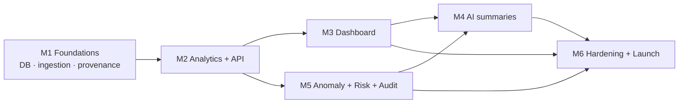

# 16 — Development Roadmap

A six-month plan to a Phase-1 production launch (Maharashtra roads). Each month ends with a demonstrable, source-linked artifact. Neutrality/traceability guardrails are built in from Month 1, not bolted on.

## Month 1 — Foundations: architecture, database, ingestion

**Goals:** stand up the skeleton and get real official data flowing into a versioned, provenance-stamped store.

- Repo/monorepo scaffold, CI, containerization, environments ([17](../02-architecture/deliverables-and-risk.md)).
- PostgreSQL + PostGIS schema from [04](../05-data-model/database-design.md); migrations; seed dimensions (fiscal years, MH districts with geometry).
- **Source registry** + first connectors: MH PWD works, MH budget/allocation docs, Mahatenders. API/CSV connectors first; PDF/OCR pipeline for budget documents.
- Object store for immutable raw artifacts; BullMQ queues; ingestion → parse → validate → normalize → dedupe → load with provenance & versioning.
- Provenance model live: every loaded row links to a source document.

**Exit criteria:** a district's road projects visible in the DB, each figure traceable to a source; re-running ingestion creates versions, not corruption.

## Month 2 — Analytics engine + APIs

**Goals:** turn the ledger into derived facts and expose them.

- Analytics service ([06](../07-analytics/analytics-engine.md)): variance, budget consistency, cost/km, district/historical comparison, inflation adjustment, contractor concentration.
- Materialized views (`mv_project_finance`) + nightly recompute cron.
- API gateway ([10](../11-api/api-documentation.md)): `/revenue`, `/projects`, `/projects/:id`, `/projects/:id/finance`, `/districts/:id`, `/contractors/:id`, `/sources/:docId`; pagination/filtering/sorting; Redis caching; OpenAPI spec.
- Read-only DB role; rate limiting; request validation (Zod).

**Exit criteria:** the worked example (₹10cr→₹9cr→₹8cr→11.1%) reproducible end-to-end via the API with sources.

## Month 3 — Dashboard

> **Reinstated 2026-08-24.** The product is **web-first**: the website ships first, the mobile app
> follows (see [`.docs/decisions/web-first-pivot.md`](../decisions/web-first-pivot.md)). This month is back in
> force, expanded into the 10-phase plan in
> [`.docs/01-product/roadmap-web.md`](./roadmap-web.md), with the
> architecture in [`.docs/02-architecture/web-architecture.md`](../02-architecture/web-architecture.md). The UI contracts
> below (`FigureWithSource`, `MissingDataWarning`, provenance on every figure, WCAG, English/Marathi)
> are unchanged and binding.

**Goals:** the public surface.

- Next.js app: Overview, Map (Mapbox + PostGIS), Project Detail with the follow-the-money chain.
- Shared components enforcing the UI contract: `FigureWithSource`, `VarianceBadge`, `ConfidenceChip`, `MissingDataWarning`, `ProvenanceDrawer`.
- ISR + CDN caching; English/Marathi i18n scaffold; WCAG AA baseline.

**Exit criteria:** a citizen can open a project and see allocation→expenditure with sources, variance, and missing-data warnings.

## Month 4 — AI summarization

**Goals:** readability, safely.

- RAG retrieval over ledger + source-document text; context builder; grounded prompt.
- Guardrail stack ([11](../09-ai/ai-layer.md)): grounding, numeric fidelity, neutrality classifier, citation enforcement, templated fallback.
- `POST /ai/ask` + "Explain" actions on Project/Audit surfaces.
- Red-team + golden-set eval suites wired into CI as release gates.

**Exit criteria:** AI answers questions/summaries strictly from cited official figures; adversarial prompts fail to elicit any accusation.

## Month 5 — Anomaly detection + risk scoring + audit view

**Goals:** surface inconsistencies as neutral, evidence-linked observations.

- Anomaly engine writing `anomaly` rows (variance, utilization/release ordering, cost/km outlier, missing records, revision spike, concentration, delay).
- Risk scoring ([07](../08-risk/risk-scoring-engine.md)) with factor breakdown; "Verification Priority" UI.
- Audit view ([09](./dashboard-design-legacy.md)) with inconsistencies, warnings, and per-item explanations + evidence links.

**Exit criteria:** every anomaly is neutral, reproducible, and links to the exact figures/sources that produced it.

## Month 6 — Hardening + production launch (Phase 1)

**Goals:** ship safely.

- Security pass ([13](../12-security/security.md)): audit logs, secrets, mTLS, backups + restore drills, WAF/rate-limit tuning, dependency/image scans.
- Provenance/versioning UX polish; correction ("report a data issue") flow.
- Legal & neutrality review against [15](../17-legal/legal-ethical-rules.md); disclaimers in place.
- Load testing, observability dashboards/alerts, runbooks; K8s production rollout; public launch.

**Exit criteria:** Phase-1 live with full traceability, guardrails enforced in CI, and operational monitoring.

## Cross-cutting workstreams (all months)

- **Data quality:** expand source coverage; tune OCR; grow entity-canonicalization rules; shrink quarantine backlog.
- **Guardrail integrity:** keep neutrality lint/eval green on every PR.
- **Docs & reproducibility:** dataset-version pinning; methodology docs public.

## Milestone dependency graph

## Team (indicative)

Backend/data engineer (ingestion+ETL), backend engineer (API+analytics), frontend engineer (dashboard+maps), data/ML engineer (AI+guardrails), part-time devops/SRE, part-time domain/public-finance advisor, part-time legal/ethics reviewer.
