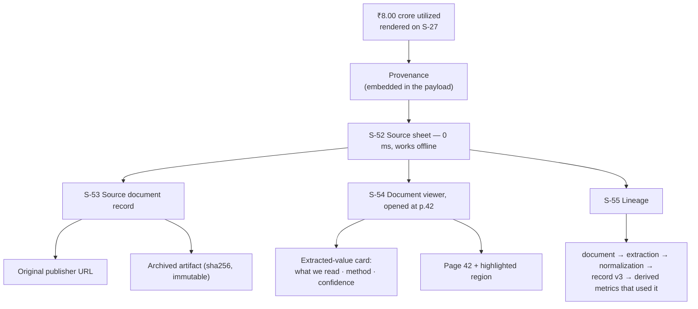

# 10 — Source Traceability

> *"Every number must be traceable. No figure is displayed without a link to its source document, extraction method, and retrieval date."* — `.docs/17-legal/legal-ethical-rules.md`, rule 5.

On mobile this rule is harder (screen space, network, 400-page scanned PDFs) and more important (a phone screenshot travels further than a desktop tab). This document specifies how the chain from a rendered figure to a page of a government document is built, and how it degrades honestly when it cannot be completed.

---

## The chain



**Architectural rule: provenance is embedded, never fetched.** Every figure in every payload carries its `provenance` object (`.docs/02-architecture/data-flow.md` §7). Consequences that matter:

- The source sheet opens instantly, with no spinner and no request.
- Traceability **works fully offline** for any cached or saved figure — the promise does not evaporate when the network does.
- A figure that arrives without provenance is **not rendered** (`.docs/10-mobile/mobile-architecture.md` §2); it renders as a `MissingProvenance` placeholder and logs a contract violation. Absence of a source is a defect, not a display variation.

---

## The provenance object (mobile contract)

```ts
type Provenance = {
  sourceDocumentId: number;
  sourceName: string;            // "Maharashtra PWD — Works"
  authority: string;             // "Government of Maharashtra, Public Works Department"
  tier: 'central' | 'state' | 'local';
  sourceUrl: string | null;      // the publisher's URL (may be dead)
  archivedUrl: string;           // our immutable copy — always present
  artifactSha256: string;
  docType: 'api'|'csv'|'xls'|'pdf'|'scan'|'html';
  extractionMethod: string;      // "api" | "camelot" | "ocr:tesseract" | …
  extractionConfidence: number;  // 0..1  — could this number be misread?     ★ C4
  linkageConfidence: number;     // 0..1  — could this belong elsewhere?      ★ C4
  pageLocator: string | null;    // "p.42 table 3"                            ★ C8
  page: number | null;           //  42   — enables Range-request open        ★ C8
  bbox: [number,number,number,number] | null;  // region highlight            ★ C8
  retrievedAt: string;
  publishedAt: string | null;
  license: string | null;
  recordVersion: number;
  supersededById: number | null;
  datasetVersion: number;
};
```

★ = a gap in the current `.docs/11-api/api-documentation.md` contract; see `.docs/11-api/client-api-contract.md`.

**The two confidences are separate and mean different things**, and conflating them (as the current docs do) hides a real risk:

| Field | Question it answers | UI when low |
|---|---|---|
| `extractionConfidence` | *Did we read this number correctly?* | Amber chip + "extracted from a scanned document; the value may contain an OCR error" |
| `linkageConfidence` | *Does this number belong to this project?* | "This record was matched to this project by name similarity (0.78). It may belong to a different work." |

A low linkage confidence is the more serious of the two — a correctly-read number attached to the wrong project is a false statement about a specific work — and the app must never present it as merely "low confidence".

---

## S-52 · The source sheet

The single most-used surface in the app. Reachable from every figure, in one tap.

```text
┌──────────────────────────────────────────────┐
│                    ────                      │
│  Utilized                                    │
│  ₹8.00 crore                                 │
│                                              │
│  Maharashtra PWD — Works                     │
│  Government of Maharashtra, PWD · State      │
│                                              │
│  Page 42, table 3                            │
│  Read by OCR (Tesseract) · confidence 82%    │
│  ⚠ Extracted from a scanned document — the   │
│    value may contain an OCR error.           │
│                                              │
│  Retrieved   30 Jul 2026                     │
│  Published   01 Dec 2025                     │
│  Version     record v3 · dataset v137        │
│  Licence     Government Open Data            │
│                                              │
│  [ View document (p.42) ]   [ Open original ]│
│  [ View lineage ]    [ Report a data issue ] │
└──────────────────────────────────────────────┘
```

Every element is deliberate: the value is repeated at the top so the sheet is self-contained in a screenshot; the authority is named in full because "PWD" alone is not attribution; the confidence caveat is in **words**, not just a chip, because a chip does not survive a screenshot.

---

## S-54 · The document viewer

The hardest surface in the product. A user tapping "view document" may be sent to page 42 of a 380-page scanned Marathi budget PDF.

**Order of presentation — non-negotiable:**

```text
1.  Extracted-value card       "This is the figure we read from this document."
                               value · method · confidence · page locator
2.  The page itself            opened at p.42, region highlighted where a bbox exists
3.  Navigation                 ‹ prev · page 42 of 380 · next › · jump to page
```

Dropping a user straight onto page 42 with no orientation guarantees confusion and, worse, invites them to conclude the app is wrong when they cannot find the number in a dense table.

**Loading.** HTTP `Range` request for the target page only (`00-document-audit` M5). A 380-page, 80 MB PDF must open in seconds over 4G. Budget: first page painted ≤ 3 s p50 on 4G. Byte progress is shown, and the total download size is stated before any full-document download.

**Security.** Only hosts present in the source registry are loadable; no script execution; no external resource loading; a 50 MB per-request cap; rendering in a sandboxed viewer. See `.docs/12-security/mobile-security.md`.

**Failure — and this is where honesty is tested:**

| Failure | Behaviour |
|---|---|
| Publisher URL dead | Show the **archived artifact** + "The publisher's copy is no longer reachable at its published URL. This is our archived copy, retrieved 30 Jul 2026 (sha256 …)." Never hide it |
| Format unsupported | "Open in browser" with the archived URL |
| Too large for the connection | State the size; offer Wi-Fi-only download; keep the extracted-value card usable |
| Offline, not downloaded | Full provenance still shown; document body unavailable, stated plainly |
| No page locator | Open at page 1 with "The exact page for this figure was not recorded" — an admission, not a silent default |

---

## S-55 · Lineage

The full derivation of one figure, which is what separates this product from a chart.

```text
₹8.00 crore  ·  Utilized  ·  Project 501  ·  FY2024-25

  ① SOURCE       MH PWD — Works, p.42 table 3
                 retrieved 30 Jul 2026 · published 01 Dec 2025
                 artifact sha256 4f3a…c19  ▸ view document

  ② EXTRACTION   OCR (Tesseract, Devanagari pack) · confidence 0.82
                 raw cell: "८,००,००,०००"  →  parsed 80000000
                 sanity checks passed: digit grouping, crore/lakh consistency

  ③ NORMALIZE    unit → ₹ (canonical) · FY → FY2024-25
                 linked to project 501 via work_id PWD-PUN-2024-1408 (exact match)

  ④ VERSION      record v3 · supersedes v2 (₹7.40 crore, 12 Mar 2026)  ▸ history
                 dataset version 137

  ⑤ USED BY      Release variance (R−U)          ▸
                 Cost per km                     ▸
                 Verification Priority · variance factor   ▸
```

Step ⑤ is the reverse index and it is what an auditor actually needs: *which conclusions rest on this number?* If the figure is later corrected, the user can see exactly what changes.

Step ④ implements `.docs/17-legal/legal-ethical-rules.md` rule 9 (preserve historical versions) — a superseded value is visible with its own source and date, so a budget revision is a fact the reader can see, not a silent overwrite.

---

## S-56 · Source registry

`.docs/06-government-sources/legacy-source-directory.md`'s registry, in the app, with live operational status per source:

```text
Maharashtra PWD — Works                          ✓ healthy
Government of Maharashtra, PWD · State · roads
Access: API   Licence: Government Open Data
Last successful fetch  30 Jul 2026, 02:00
Records ingested       18,442
Link health            OK (checked 18 Aug 2026)
▸ open portal   ▸ records from this source
```

This makes the platform's **own data supply auditable by the public** — a source that has not updated in eight months is itself a finding a journalist can use, and hiding it would be inconsistent with everything else the product claims.

---

## Sharing and export

Any shared artifact carries its sources. This is the mechanism that partly compensates for having no website (`00-document-audit` PR-1).

| Artifact | Contents |
|---|---|
| Share link | Universal link to the entity; provenance travels with the entity |
| Share evidence (an observation) | The neutral observation text, every input figure, each with source name + URL + confidence + `asOf`, the `datasetVersion`, and the standing disclaimer |
| CSV of a view | One row per record, with `source_name`, `source_url`, `extraction_method`, `extraction_confidence`, `retrieved_at`, `dataset_version` as columns |

**A figure is never exported without its source columns.** An exported number that has been separated from its provenance is precisely the artifact `.docs/17-legal/legal-ethical-rules.md` exists to prevent, and it is why chart-to-PNG export is not built (`.docs/01-product/screen-inventory.md` §Screens that must not exist).

---

## Verification checklist (a screen fails review if any is false)

- [ ] Every monetary and derived figure on the screen has a tappable source affordance.
- [ ] The source sheet opens with no network request and works offline.
- [ ] Extraction confidence < 0.90 is stated in words, not only as a chip.
- [ ] Linkage confidence < 0.95 is stated separately from extraction confidence.
- [ ] A null value renders `MissingData` with a reason and the responsible source — never ₹0, never blank.
- [ ] The document opens at the recorded page, or admits that no page was recorded.
- [ ] A dead publisher URL is disclosed, with the archived copy offered.
- [ ] Every figure on the screen shares one `datasetVersion`, and it is displayed.
- [ ] A superseded value is reachable from the current one.
- [ ] Any export from this screen carries the source columns.
