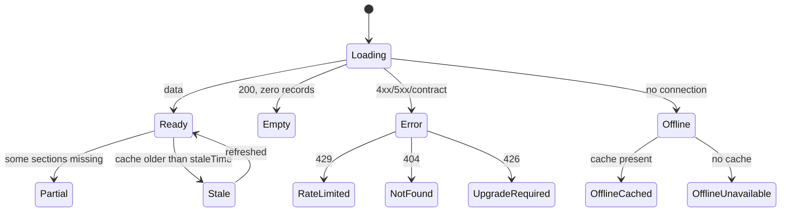

# 15 — Loading, Empty, Error, Offline & Partial States

In most products, states are polish. Here, three of them are **data-honesty controls**:

- An empty state that says "no data" where the truth is "not published yet" makes a false statement about a government body.
- An offline state indistinguishable from a coverage gap turns a dropped connection into an implied non-publication.
- A zero rendered where a record is missing manufactures a variance out of nothing — and a fabricated variance is exactly the kind of implied accusation `.docs/17-legal/legal-ethical-rules.md` forbids.

**Three inviolable rules:**

> **R1 — Missing is never zero.** A null financial value renders `MissingData` with a reason. It never renders `₹0`, never a blank, never a dash.
> **R2 — "Offline" and "not published" are different states**, with different copy, different icons, and different actions.
> **R3 — Every state names the responsible source.** "We expected this from _MH PWD — Works_, last checked 18 Aug 2026."

---

## The state machine

Every data-bearing surface resolves to exactly one:



`Ready` is not the only success state. `Partial` and `Stale` are successes that must be _labelled_ successes.

---

## Loading

**Skeleton-first, spinner almost never.** Skeletons are shape-matched to the real content — a Money Trail skeleton has three stages and two variance rows, not three grey bars.

| Situation                      | Treatment                                                           |
| ------------------------------ | ------------------------------------------------------------------- |
| Screen push                    | Header renders from route params in frame 1; body skeletons         |
| Section                        | Section-level skeleton; other sections continue independently       |
| List page 2+                   | Inline footer skeleton; existing rows never blocked                 |
| Refresh (data present)         | Subtle top progress line; **content stays visible and interactive** |
| Sheet                          | Content is already in memory — no loading state at all for S-52     |
| >2 s                           | Skeleton gains a text line: "Still loading…"                        |
| >8 s                           | Becomes `Error` with retry                                          |
| Long operation (pack download) | Determinate progress + byte counts + cancel                         |

Never: a full-screen spinner over existing content · a blocking modal · a layout that shifts when data lands (skeletons reserve real dimensions) · shimmer when `reduceMotion` is on.

---

## Empty — five distinct kinds

This is where most products collapse five meanings into one message. Each of these tells the user something different and needs a different action.

### E1 · No records published (the most common, and the most sensitive)

```text
   ▤   No expenditure records published

       No expenditure has been published for this project
       for FY2024-25 in the sources we've ingested.

       This does not mean no money was spent — it means
       the record has not been published or collected yet.

       Expected source:  MH PWD — Works
       Last checked:     18 Aug 2026

       [ Try another year ]  [ Report a data issue ]  [ What we cover ]
```

The third paragraph is mandatory and is a direct implementation of `.docs/17-legal/legal-ethical-rules.md` rule 8 (_absence of data ≠ absence of activity_). It is stated in words on the screen, not left to inference.

### E2 · Outside coverage

```text
   ◷   Not yet covered
       LokDarpan currently covers Maharashtra roads (Phase 1).
       Health projects in Nashik aren't ingested yet.
       [ What we cover ]   [ Nearest covered area ]
```

### E3 · Filtered to nothing

```text
   ⌕   No results with these filters
       142 projects in Pune district; none match
       "completed" + "cost/km above median".
       [ Clear filters ]  [ Remove 'completed' ]
```

Always states what _would_ be there without the filters — otherwise a user reads a filter artefact as a coverage gap.

### E4 · Nothing saved yet (the only "teaching" empty state)

```text
   ☆   Nothing saved yet
       Save a project to keep its figures, sources and updates —
       and to read it offline.
       [ Explore near me ]  [ Search ]
```

### E5 · Genuinely zero

A count that is legitimately zero (e.g. "0 bridges in this project") renders inline as `0`, not as an empty state — a true zero is a fact, and dressing it up as an absence would be its own kind of dishonesty. R1 governs _missing_, not _zero_.

---

## Error

Every error states what happened, what it means, and what to do — and preserves whatever data is already on screen.

| State                      | Copy                                                                                                                                                           | Actions                                |
| -------------------------- | -------------------------------------------------------------------------------------------------------------------------------------------------------------- | -------------------------------------- |
| **Network**                | "Couldn't reach LokDarpan. Check your connection."                                                                                                             | Retry · (cached content stays visible) |
| **Server (5xx)**           | "LokDarpan is having trouble loading this. It's not your connection."                                                                                          | Retry · Copy diagnostics (`requestId`) |
| **Rate limited (429)**     | "Too many requests just now. Retrying in 14s…" — auto-retry, countdown, never alarming                                                                         | (automatic)                            |
| **Not found (404)**        | "This record is no longer in the published dataset. It may have been superseded or removed by the source."                                                     | Search · Report a data issue           |
| **Contract mismatch**      | Silent to the user where cached data exists; otherwise "Some details are unavailable right now." **Never crashes, never partially renders a financial figure** | Retry · logged with `requestId`        |
| **Upgrade required (426)** | "This version of LokDarpan is too old to read the current data."                                                                                               | Update · **dismissible when offline**  |
| **Location denied**        | Not an error — S-05 "Choose your area" is offered as an equal path                                                                                             | Choose area · Open settings            |
| **Document unavailable**   | "The publisher's copy is no longer reachable. This is our archived copy from 30 Jul 2026."                                                                     | View archived · Open original          |

**Section-level, not screen-level.** A failed road-intelligence section shows an inline retry while the Money Trail beside it keeps working (`.docs/02-architecture/mobile-architecture.md` §Error boundaries). A whole-screen error for a partial failure discards data the user could have used.

**Never:** a raw HTTP status · a stack trace · "Oops!" · a blaming tone · a dead end without an action · an error that clears already-loaded content.

---

## Offline — two states, deliberately distinct from Empty

### O1 · Offline with cache

```text
┌─────────────────────────────────────────────┐
│ ⚡ Offline — showing data from 14 Aug 2026  │   persistent, non-blocking
└─────────────────────────────────────────────┘
```

Content renders fully. Every figure keeps its own `asOf`. Actions requiring the network (Ask, document download, remote search) are visibly disabled with a reason, not silently inert.

### O2 · Offline without cache

```text
   ⚡   You're offline
        This project hasn't been downloaded to your device.

        Different from "no records published" — we simply
        can't reach LokDarpan right now.

        [ Retry ]   [ Save for offline when you reconnect ]
```

The second paragraph exists solely to enforce **R2**. It is the sentence that prevents a network failure from being read as a government's failure to publish.

---

## Partial data

A screen where some sections resolved and others did not:

```text
┌─────────────────────────────────────────────┐
│ ⓘ Some information couldn't be loaded.      │
│   Financial records and sources are shown.  │
│   Tender details are unavailable.  [Retry]  │
└─────────────────────────────────────────────┘
```

And within the data itself — a chain with a missing link:

```text
  ALLOCATED   ₹10.00 crore   🔗
        │
        ├─ Allocation variance: cannot be calculated
        │  (no expenditure records)
        │
  RELEASED    ₹9.00 crore    🔗
        │
  UTILIZED    ▤ No expenditure records published for FY2024-25
              Expected source: MH PWD — Works · last checked 18 Aug

  Status: ⊘ Insufficient data
```

**No variance is computed across a missing stage.** The status becomes `insufficient_data` (`.docs/07-analytics/analytics-engine.md` §2) — a first-class state, visually distinct from both "consistent" and "needs verification", and never silently rendered as a 100% variance against zero.

---

## Stale data

```text
Ready + cache older than staleTime, online:
    per-figure "as of 4 Aug" captions (always present anyway)
  + if datasetVersion has moved:
    ┌────────────────────────────────────────┐
    │ Updated data available   [ Refresh ]   │  ← dismissible chip, non-blocking
    └────────────────────────────────────────┘
```

The chip never auto-refreshes the screen under the user — a journalist mid-read must not have figures change beneath them. Refresh is always their action.

---

## Low-confidence and superseded values

Neither is an error, and both must be visible (`.docs/17-legal/legal-ethical-rules.md` rules 7 and 9):

```text
Low extraction confidence (<0.90)
    ₹8.00 crore   ⚠ 82%
    "Extracted from a scanned document — the value may contain an OCR error."

Low linkage confidence (<0.95)
    ₹8.00 crore   ⚠ matched
    "This record was matched to this project by name similarity (0.78).
     It may belong to a different work."

Superseded
    ₹8.00 crore   (revised)
    "Previous value ₹7.40 crore, published 12 Mar 2026."   ▸ history
```

Low **linkage** confidence is the more serious of the two — a correctly-read number attached to the wrong project is a false statement about a specific work — and it therefore gets its own wording rather than being folded into "low confidence".

---

## Permission states

| Permission    | Denied behaviour                                                                                                                                  |
| ------------- | ------------------------------------------------------------------------------------------------------------------------------------------------- |
| Location      | Never a blocker. S-05 remains a permanent equal path. The "locate me" button is disabled with "Location access is off — choose your area instead" |
| Notifications | Watchlist still works; updates appear in S-11. Copy: "You'll see updates in the app; enable notifications to be told sooner"                      |
| Microphone    | Voice search hidden; typing unaffected                                                                                                            |

No permission is ever re-requested after a denial except from an explicit user action, and the app never nags.

---

## Implementation

```ts
type DataState<T> =
  | { kind: "loading"; skeleton: SkeletonShape }
  | { kind: "ready"; data: T; asOf: IsoDate; datasetVersion: number; isStale: boolean }
  | { kind: "partial"; data: Partial<T>; missing: SectionId[]; reason: PartialReason }
  | {
      kind: "empty";
      variant: "unpublished" | "uncovered" | "filtered" | "none-saved";
      expectedSource?: SourceRef;
      lastChecked?: IsoDate;
    }
  | { kind: "error"; error: AppError; cached?: T }
  | { kind: "offline"; cached?: T; asOf?: IsoDate };
```

A closed discriminated union means a screen **cannot** forget a state — an unhandled variant is a TypeScript error. `empty` carries `expectedSource` and `lastChecked` in its type, so **R3 is enforced by the compiler**, not by review.

---

## Review checklist (a screen is not done until all pass)

- [ ] All eight top-level states designed and implemented for every data-bearing section
- [ ] Skeletons shape-matched; no layout shift when data lands
- [ ] Every empty state distinguishes E1/E2/E3 and names its expected source and last-checked date
- [ ] Offline-with-cache and offline-without-cache are visually and textually distinct from Empty
- [ ] No null financial value renders as `₹0`, blank, or `—`
- [ ] No variance computed across a missing stage; `insufficient_data` is visually distinct
- [ ] Errors are section-scoped; loaded content is never cleared
- [ ] Every error offers a next action; `requestId` is copyable
- [ ] Low extraction confidence and low linkage confidence have distinct wording
- [ ] Superseded values are reachable from the current value
- [ ] All state copy passes the neutrality lint in all locales
- [ ] All states screen-reader-announced and tested at 200% text scale
