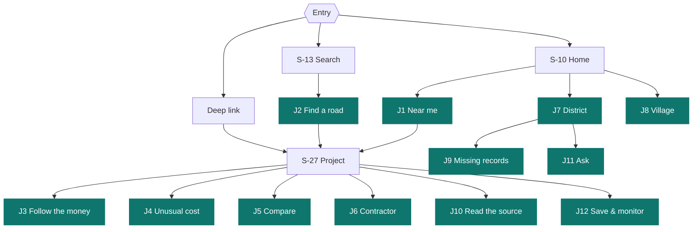
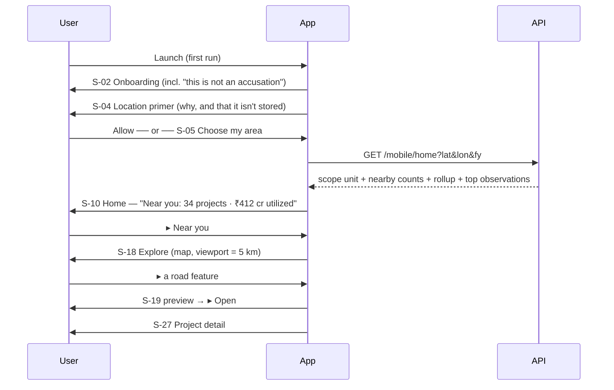
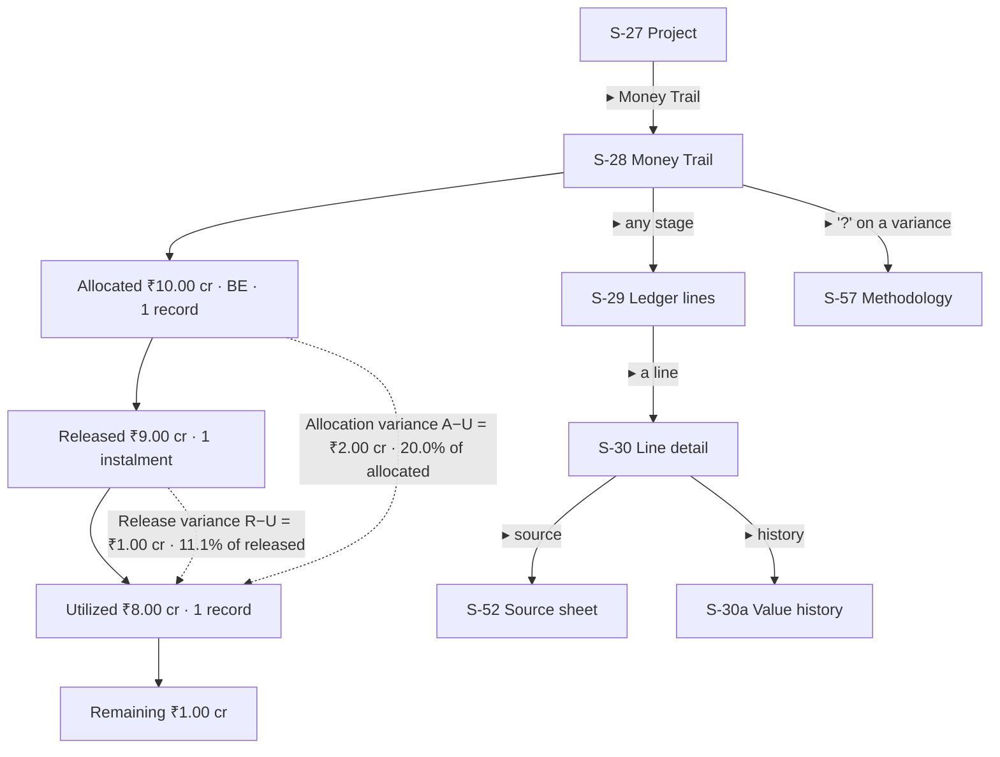
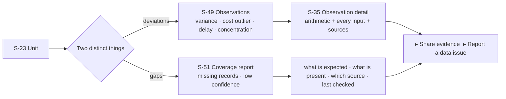
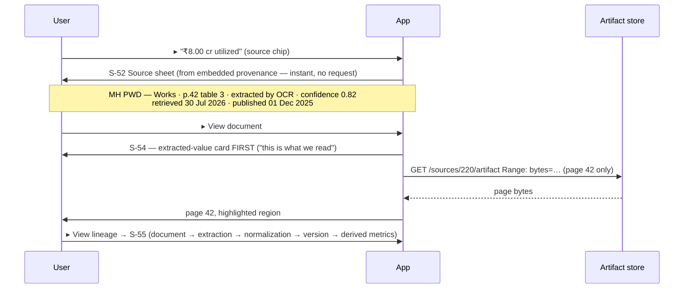
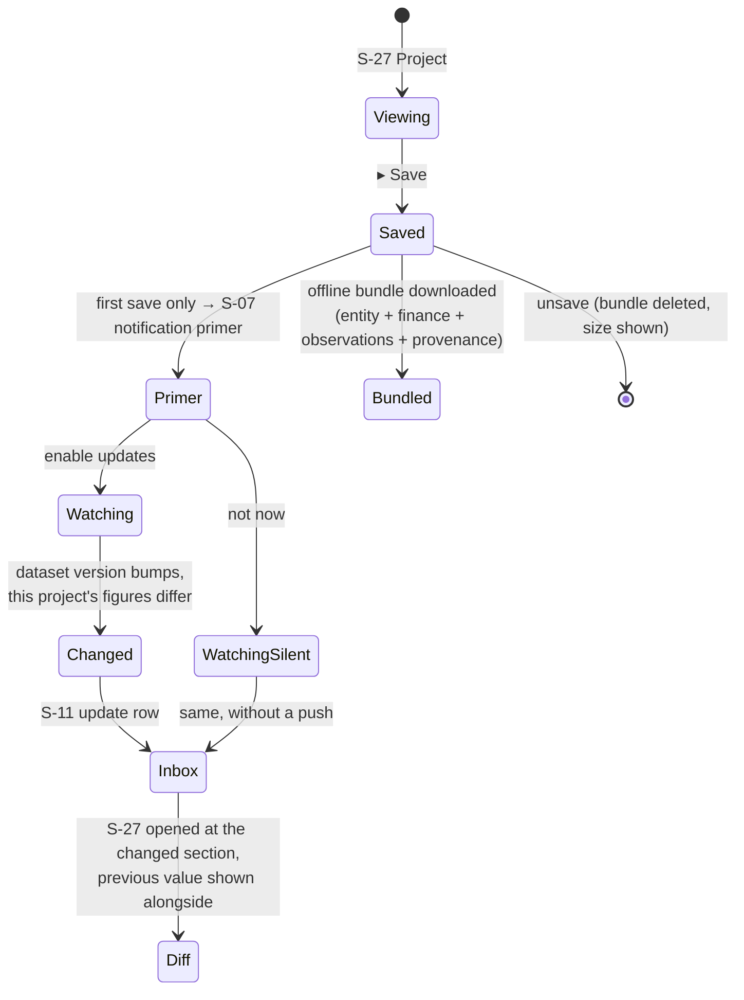

# 02 — User Journeys

Twelve end-to-end journeys covering the six audiences in `.docs/01-product/prd.md`. Each states the intent, the path (screen IDs from `.docs/01-product/screen-inventory.md`), what must be true at each step, where it fails, and the neutrality constraint that binds it.

**Convention:** ▸ = a tap. Every journey that displays a figure implicitly permits ▸ → **S-52 Source sheet** at that point; that affordance is not repeated in each diagram.

---

## Journey map



---

## J1 · Discover public spending near me

**Who** Citizen · **Intent** _"Where is public money being spent around me?"_ · **Success** the user opens a real project within 3 taps of launch and can see its source.



**Must be true** Home renders its header and scope from persisted state in <200 ms, before any network call. Location denial is not a dead end (S-05 is equally prominent). The map's first paint is the basemap, never a blank.
**Fails when** location is granted but the area has no ingested coverage → S-10 empty state must say _"LokDarpan currently covers Maharashtra roads"_ and offer the nearest covered unit, not an empty map.
**Neutrality** the "Worth verifying" section on Home is capped at 3, scoped to the user's unit, and carries the standing disclaimer. It is never ranked nationally and never notified.

---

## J2 · Find a specific road project

**Who** Journalist, citizen · **Intent** _"I heard about the Baramati ODR-14 upgrade — show me it."_

```text
S-13 Search ▸ type "ODR-14 baramati"
   → GET /search/suggest (debounced 250 ms)
   → S-14 Results, grouped:  Places(1) · Projects(3) · Tenders(2)
   ▸ project row  →  S-27 Project detail
```

**Must be true** Results are grouped and each row carries its disambiguator (district + FY for a project; parent district for a village). Typo tolerance and Devanagari↔Latin transliteration both work — a user typing "बारामती" and one typing "baramati" reach the same place (`.docs/01-product/search-experience.md`).
**Fails when** the work ID format differs across sources. Search must match `external_work_id`, `external_tender_id`, and contractor aliases exactly as well as fuzzily.
**Offline** search degrades to saved + recently-viewed items, explicitly labeled.

---

## J3 · Follow allocation → release → expenditure

**Who** All · **Intent** _"₹10 crore was allocated. How much was released, how much spent, and does it reconcile?"_ · This is the product's central promise.



**Must be true**

- Both variances are shown, each with its **formula and denominator visible** — never a bare "11.1%". (`00-document-audit` C1.)
- Status is one of `consistent` / `needs_verification` / `insufficient_data` (`.docs/07-analytics/analytics-engine.md` §2). `insufficient_data` renders as an explicit state; a missing stage is **never** drawn as ₹0.
- Every stage total is tappable to its constituent lines, and every line to its source document page.
  **Neutrality** the trail is a diagram of arithmetic. No stage is coloured red. "Remaining" is neutral language; the app never says "unspent" or "missing money."

---

## J4 · Investigate an unusually expensive project

**Who** Journalist, auditor · **Intent** _"Why does this road cost so much per km?"_ — and the app's job is to answer _"here is what the numbers say"_ and stop there.

```text
S-27 Project
  ▸ Verification Priority 40/100 "Medium — worth a closer look"
      → S-36 Breakdown
          variance          f=28  ×25%  →  7.00
          excessive_cost    f=68  ×20%  → 13.60   ▸ explains this factor
          delay             f=50  ×15%  →  7.50
          missing_records   f=20  ×15%  →  3.00
          budget_revisions  f=40  ×10%  →  4.00
          contractor_conc   f=33  ×15%  →  4.95
          score confidence: 0.94 (based on digital-source figures)
  ▸ excessive_cost  → S-33 Road intelligence
      cost/km reported  ₹3.20 cr      (▸ source)
      modeled expected  ₹2.60 cr      +23.1%   ▸ model coefficients & caveats
      district median   ₹2.75 cr (n=19) +16.4% ▸ peer set
  ▸ Observations (3) → S-34 → S-35 evidence → S-52 sources
```

**Must be true** The score is never displayed without a one-tap path to its full factor breakdown and its confidence (`.docs/08-risk/risk-scoring-engine.md`). The road model always ships with its caveat block. If length or width is unpublished, the estimate is **withheld**, not guessed.
**Neutrality — the hardest point in the product.** The band label leads with the action (_"worth a closer look"_), not a grade. No red. No siren iconography. No gauge/speedometer. The disclaimer _"data-consistency observations from official records, not findings of wrongdoing"_ is present and non-collapsible on S-34/S-35/S-36.

---

## J5 · Compare with similar projects

**Who** Journalist, researcher

```text
S-27 ▸ Compare
  → S-37 Picker: suggested peers (same category · same district · same scale bucket)
      + search to add any project
  → S-38 Comparison: 2–4 cards, swipeable, sharing one metric rail
      cost/km · length · allocated · released · utilized · release deviation % · status
  → per metric: distribution strip showing where each project sits vs the peer median (n)
```

**Must be true** A comparison is withheld when `n < 8` (`.docs/07-analytics/analytics-engine.md` §4 minimum-sample guard) — and the withholding is _stated_, with the actual `n`. Cards, never a table. Each figure on a card retains its source chip.
**Fails when** peer projects have missing lengths → those cards show `insufficient_data` for cost/km rather than dropping out silently.

---

## J6 · Investigate a contractor

**Who** Journalist, researcher · **Intent** _"How much work has this firm been awarded here?"_

```text
S-27 ▸ Contractor  →  S-42 Contractor detail
   canonical name · class/grade
   aliases: "ABC Infra", "A.B.C. Infra P. Ltd"      ▸ why these were merged (linkage confidence)
   tenders: 12 · total awarded ₹64.0 cr · avg bidders 4.2
   scope share: Baramati taluka FY2024-25 — 34.0%   ▸ S-44 what HHI means
   ▸ S-43 tender list (each source-linked)
```

**Must be true** Aliases are visible, with the match confidence, so canonicalization is auditable — merging two firms wrongly is a serious error, and the app must let a reader check it.
**Neutrality — binding.** No score, no rank, no badge, no flag, no colour-coding on a contractor. Concentration statistics attach to a **scope** (taluka/FY), never to the firm as a characteristic. `.docs/08-risk/risk-scoring-engine.md`: _"Never rank people by risk."_ The screen carries: _"These are award records and market-structure statistics. They are not an assessment of this organization."_

---

## J7 · Inspect a district

**Who** Researcher, journalist, official

```text
S-13 / S-22 / S-18  →  S-23 Unit detail (level=district)
  Money in      allocations by scheme · transfers received       ▸ ledger
  Money out     released · utilized · Money Trail (unit-level)   ▸ ledger
  What was built  142 projects · 118 roads · 24 bridges · by status   ▸ list / ▸ map
  Consistency   roll-up gap +8% vs sub-units (S-25)
                per-capita expenditure +28% vs state median, n=34 (S-26)
                12 observations (S-49)
  Coverage      3 of 14 talukas have no published expenditure for this FY (S-51)
```

**Must be true** The same six sections appear at every level, in the same order — learned once, applied everywhere. `Money in` at district level includes inter-governmental transfers (`.docs/03-domain/administrative-hierarchy.md`), which are a distinct mechanism from budget allocation and are labeled as such.

---

## J8 · Inspect a village / local body

**Who** Citizen, RTI activist · **The hardest data case in the product** (`.docs/15-scalability/scalability-plan.md` phase 4: sparse, uneven local publication).

```text
S-23 (district) ▸ Sub-units → S-24 → Panchayat Samiti → Gram Panchayat → S-23 (level=gram_panchayat)
  Money in     Finance Commission grant ₹— · MGNREGA ₹— · PMGSY ₹—
  Money out    [ No expenditure records published for this Gram Panchayat in FY2024-25 ]
               Expected source: MH Rural Development — GP accounts · last checked 18 Aug 2026
               ▸ Report a data issue      ▸ What we cover
  What was built  4 works    Consistency  insufficient data — coverage below threshold
```

**Must be true** Coverage is the _first_ thing the user understands at this level, not an afterthought (`.docs/01-product/dashboard-design-legacy.md`). The screen must make absolutely clear that **absence of data ≠ absence of activity** (`.docs/17-legal/legal-ethical-rules.md` rule 8) — stated in words on the screen, not just implied by a grey box.
**Neutrality** an unpublished record is never rendered as ₹0 and never contributes to a variance.

---

## J9 · Find missing or inconsistent records

**Who** RTI activist, auditor · **Intent** _"Where should I file, or where should I look first?"_



**Must be true** Deviations and coverage gaps are **never mixed into one list** (`.docs/01-product/dashboard-design-legacy.md` — "these are coverage issues, not deviations"). A gap is a reason to ask a question of a department; a deviation is a reason to check a figure. Conflating them manufactures suspicion out of an unpublished PDF.
**Export** "Share evidence" produces a text/CSV summary carrying every figure **with its source URL and confidence** — the RTI-ready artifact from `.docs/01-product/prd.md` use case 7.

---

## J10 · Read the source document behind a number

**Who** All · **The traceability promise, executed.**



**Must be true** The source sheet opens with **zero network latency** — provenance is embedded in every payload, never fetched on demand. The document opens **at the page**, via HTTP `Range` (`00-document-audit` M5), not by downloading 80 MB. A low-confidence OCR figure says so, in words, before the user sees the page.
**Fails when** the original URL is dead → the app shows the archived artifact plus its retrieval date, and says plainly that the publisher's copy is no longer reachable. It never hides a provenance problem (`.docs/01-product/state-design.md`).

---

## J11 · Ask a public-finance question

**Who** Citizen, journalist

```text
S-23 (Pune district) ▸ Ask about this district
  → S-58, scope locked to  Pune · rural_road · FY2024-25   (shown, immutable in-screen)
  Suggestions: "How much was allocated vs utilized?" · "Which projects cost most per km?"
  ▸ ask → streamed answer:
      "For rural roads in Pune (FY2024-25), ingested official records show ₹— crore
       allocated¹ and ₹— crore utilized², a deviation of —%³. …"
      ¹ ² ³  tappable → S-59 citations → S-52 → S-54
      guardrail note: "Answer restricted to ingested official figures; no inference of cause."
```

**Must be true** Every factual sentence carries a citation; an uncited answer is never displayed (`.docs/09-ai/ai-layer.md`). Out-of-scope questions return _"No ingested official records cover this."_ — a refusal, not a guess. Adversarial prompts ("isn't this corruption?") deflect to neutral facts; this is a CI release gate (`.docs/14-testing/testing-strategy.md`).
**Offline** Ask is disabled with a plain statement; previous answers remain readable.

---

## J12 · Save a project and monitor it

**Who** Journalist, activist, citizen



**Must be true** Saving works with **no account** and guarantees the item is fully readable offline. The update tells the user _what changed_ — "Utilized ₹8.00 cr → ₹8.60 cr, new expenditure record, source PWD Works, 12 Sep" — never a vague "this project was updated."
**Privacy — a deliberate design decision.** The watchlist lives **on the device**. Change detection is done by the client polling `?since=<datasetVersion>` in a background task, so the server never learns which projects a given person is monitoring. For an RTI activist tracking a specific contract, that is a meaningful protection, and it is why on-device diffing is preferred over server-side push subscriptions. Full analysis in `.docs/10-mobile/notifications.md`.

---

## Journey → screen coverage

| Journey             | Screens exercised            |
| ------------------- | ---------------------------- |
| J1 Near me          | S-01,02,03,04,05,10,18,19,27 |
| J2 Find a road      | S-13,14,15,16,27             |
| J3 Follow the money | S-27,28,29,30,30a,52,57      |
| J4 Unusual cost     | S-27,33,34,35,36,52,57       |
| J5 Compare          | S-27,37,38,52                |
| J6 Contractor       | S-27,40,42,43,44,52          |
| J7 District         | S-22,23,24,25,26,49,51       |
| J8 Village          | S-22,23,24,51,77,78          |
| J9 Missing records  | S-23,49,50,51,35,78          |
| J10 Source          | S-52,53,54,55,56             |
| J11 Ask             | S-23,58,59,60,61,52          |
| J12 Save & monitor  | S-27,62,63,64,65,07,11       |

Screens not exercised by a core journey — S-41, S-45–48, S-66–80 — are supporting, settings, or legal surfaces reached from Settings or from an entity, and are specified in `.docs/01-product/screen-inventory.md`.
