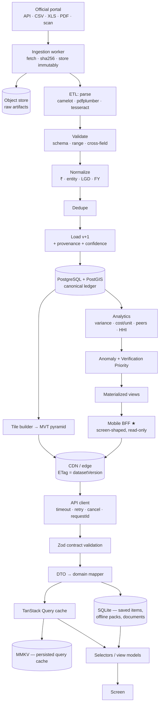
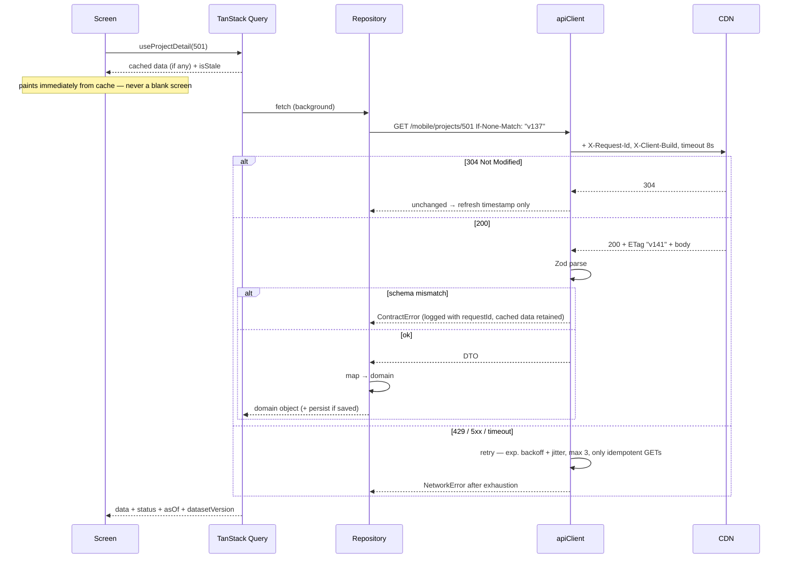
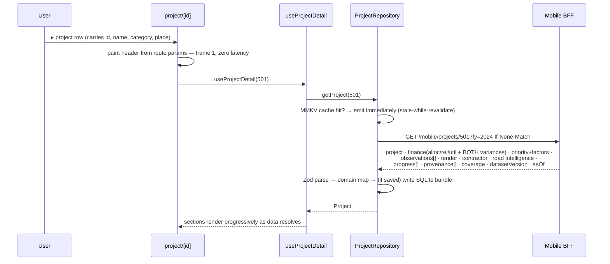
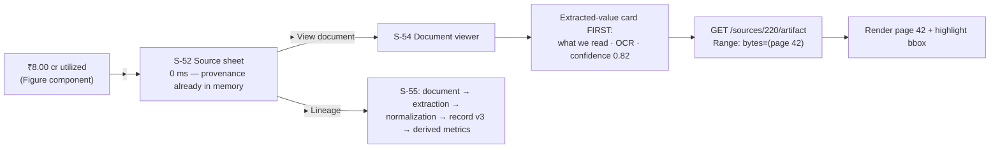
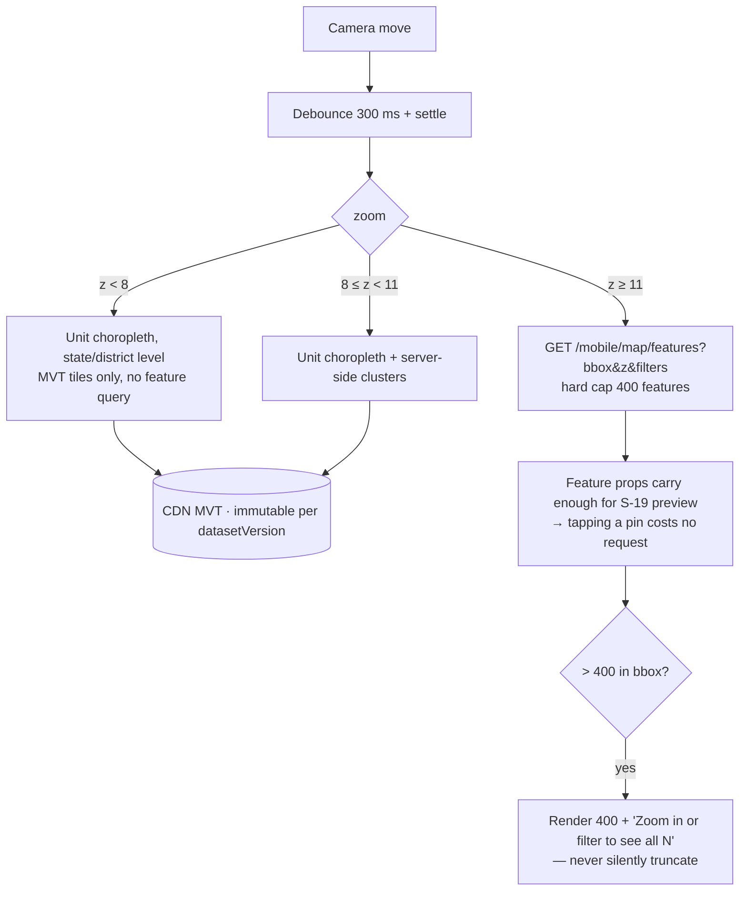
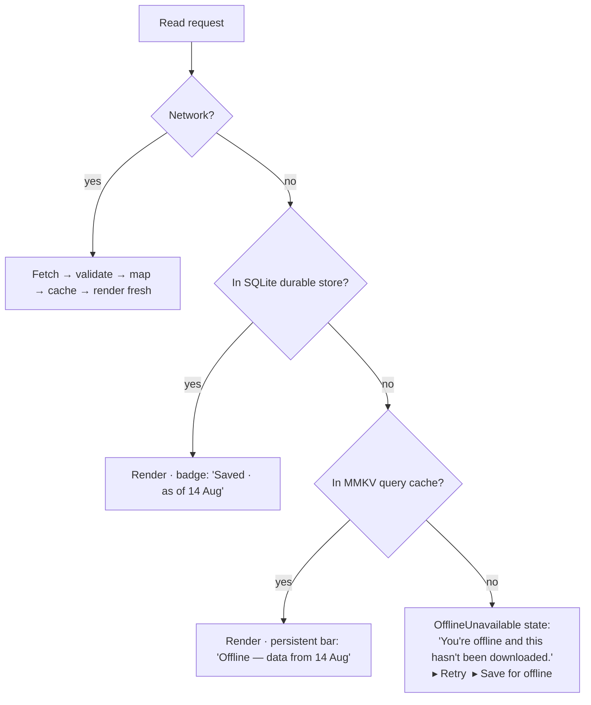

# 04 — Data Flow

How data reaches a pixel, and how it survives a bad network. Covers the end-to-end pipeline, the client's layered data path, caching, invalidation, pagination, retry, offline, and the three flows that carry the most product weight.

---

## 1 · End-to-end: government portal → pixel



Everything left of the CDN is `.docs/02-architecture/system-architecture.md`/`03`/`06`/`07`/`20`, unchanged. Everything right of it is this architecture. The **★ Mobile BFF** is the one new backend component (`.docs/11-api/client-api-contract.md`).

**Invariant:** the client performs **no financial arithmetic**. Variance, deviation %, cost/km, peer medians, HHI, roll-up gaps, and Verification Priority all arrive computed, versioned, and source-linked. The client formats, lays out, and caches. This is what makes `.docs/17-legal/legal-ethical-rules.md` rule 4 ("show only facts") enforceable — the app has no ability to invent a number.

---

## 2 · Client layers

```text
Screen (React)              — no fetching, no formatting rules, no business logic
   ↕ useProjectDetail()      view-model hook: query + selector + derived UI state
Feature hook                — composes repositories, owns loading/error/offline semantics
   ↕
Repository                  — the ONLY place that knows about the network or SQLite
   ├─ RemoteDataSource      — apiClient + Zod schema + DTO→domain mapper
   └─ LocalDataSource       — SQLite (durable) · MMKV (ephemeral)
   ↕
apiClient                   — timeout, retry, cancellation, ETag, requestId, error normalization
```

**Boundaries that are enforced, not merely recommended** (`.docs/02-architecture/mobile-architecture.md` §Dependency rules, ESLint `import/no-restricted-paths`):

- A screen may not import `apiClient`, a Zod schema, or a SQLite handle.
- A repository may not import React.
- A DTO type may not escape the repository layer; screens see domain types only.

---

## 3 · Request lifecycle



**apiClient responsibilities** (one module, no exceptions):

| Concern       | Behaviour                                                                                                                                                                                       |
| ------------- | ----------------------------------------------------------------------------------------------------------------------------------------------------------------------------------------------- |
| Timeout       | 8 s default; 20 s document range requests; 30 s AI stream; per-call override                                                                                                                    |
| Retry         | GET only; 3 attempts; exponential backoff 500 ms × 2ⁿ ± 30% jitter; retries `408/429/500/502/503/504` and network errors; **never** retries `4xx` other than 408/429                            |
| `429`         | Honours `Retry-After`; surfaces a distinct `RateLimited` state, not a generic error (`00-document-audit` C9)                                                                                    |
| Cancellation  | `AbortSignal` from the query; every in-flight request for an unmounted screen is aborted                                                                                                        |
| Caching       | `If-None-Match` from the stored ETag; ETag is the `datasetVersion`                                                                                                                              |
| Observability | `X-Request-Id` (client-generated UUID) on every request, echoed in errors and shown in the error UI's "copy diagnostics" — makes a user report traceable to a server log                        |
| Errors        | Normalized to a closed union: `Network · Timeout · RateLimited · NotFound · Server · Contract · UpgradeRequired · Offline`. Screens switch on the union; no screen inspects an HTTP status code |
| Auth          | None by default (anonymous public tier). If an account exists, a bearer token is attached from SecureStore — never from MMKV/AsyncStorage                                                       |

---

## 4 · Caching and invalidation

Three tiers, with different lifetimes and different guarantees:

| Tier          | Store                 | Contents                                                | Eviction                                    | Guarantee                                         |
| ------------- | --------------------- | ------------------------------------------------------- | ------------------------------------------- | ------------------------------------------------- |
| **Ephemeral** | TanStack Query → MMKV | Everything viewed recently                              | LRU, 24 MB cap, 14-day max age              | "What you looked at recently still opens offline" |
| **Durable**   | SQLite                | Saved items + their full offline bundles; offline packs | Only on explicit user delete                | "Saved items are guaranteed complete offline"     |
| **Binary**    | Filesystem            | Downloaded source documents, map tile packs             | Explicit delete; size shown before download | "You chose this; it stays until you remove it"    |

### Freshness policy per data class

| Data                          | `staleTime`                             | `gcTime` | Refetch on focus | Rationale                                                                             |
| ----------------------------- | --------------------------------------- | -------- | ---------------- | ------------------------------------------------------------------------------------- |
| Entity detail (project, unit) | 15 min                                  | 14 d     | No               | Dataset publishes at most daily (`.docs/02-architecture/system-architecture.md` cron) |
| Lists / feeds                 | 5 min                                   | 7 d      | No               |                                                                                       |
| Search suggest                | 60 s                                    | 10 min   | No               |                                                                                       |
| Search results                | 0 (always fetch)                        | 1 h      | No               | Query intent is explicit                                                              |
| `meta/dataset-version`        | 5 min                                   | ∞        | **Yes**          | The invalidation trigger                                                              |
| `meta/client-support`         | 6 h                                     | ∞        | Yes              |                                                                                       |
| Map features (bbox)           | 10 min                                  | 1 h      | No               |                                                                                       |
| MVT tiles                     | HTTP cache, keyed by `datasetVersion`   | 30 d     | —                | Immutable per version                                                                 |
| AI answers                    | ∞ per (scope, question, datasetVersion) | 7 d      | No               | Deterministic key; re-asking shouldn't re-bill                                        |
| Provenance                    | Lifetime of the figure it belongs to    | —        | —                | Embedded, never separately fetched                                                    |

### Invalidation

The server owns invalidation; the client just observes the version.

```text
ETL publishes  →  dataset.published(v141)  →  ETag changes at the edge
Client (on foreground, ≤ every 5 min):  GET /meta/dataset-version
   v141 ≠ cached v137
      → mark all cached entity queries stale (do NOT evict — offline reads must still work)
      → refetch only what is currently mounted
      → enqueue a background diff for saved items:  GET /mobile/watchlist/changes?since=137
      → show, on affected screens, a non-blocking "Updated data available — refresh" chip
```

Rules:

- **Stale data is never evicted on a version bump.** Eviction would turn a version bump into an offline outage. It is marked, refetched when visible, and always rendered with its `asOf`.
- **Never a full cache clear** on version bump — that would re-download an offline pack over metered data.
- Manual pull-to-refresh forces `staleTime: 0` for that screen's queries only.

---

## 5 · Pagination

Cursor-based for every feed (`00-document-audit` C6). Offset pagination against a live, versioned dataset silently duplicates and skips rows — unacceptable when the rows are financial records.

```text
GET /mobile/observations?unitId=532&cursor=<opaque>&limit=25
  → { data: [...], meta: { nextCursor, datasetVersion, asOf } }
```

- Cursor encodes `(sortKey, id, datasetVersion)`. If `datasetVersion` in the cursor differs from current, the server returns `409 CursorStale`; the client restarts the list from the top and shows "Data updated — showing from the start."
- Page size 25 default, 50 max. `FlashList` + `useInfiniteQuery`; prefetch the next page at 70% scroll.
- Bounded lists (a unit's children, a project's ledger lines, a scheme list) stay page-based — they are small, complete, and cacheable as a unit.

---

## 6 · Flow A — Project detail (the core flow)



**Why one composite request.** The `.docs/11-api/api-documentation.md` REST surface would require `/projects/:id` + `/finance` + `/timeline` + `/risk` + `/anomalies` + `/tenders/:id` + `/contractors/:id` ≥ 7 round trips. At 300 ms RTT on a congested 4G cell that is **>2 s of pure latency** before rendering, and 7 independent failure modes, 7 ETags, and 7 chances to display figures from two different `datasetVersion`s side by side — which would be a traceability defect, not just slow.

One request gives: one latency, one ETag, one failure mode, **one `datasetVersion` across every figure on the screen**.

**Payload budget:** ≤ 60 KB gzipped p95. Progress snapshots capped at the most recent 12 (full history behind S-32); observations capped at 10 (full list behind S-34); ledger lines are _not_ included (summaries only — lines load on demand at S-29).

---

## 7 · Flow B — Figure → source → document page

The traceability promise, and the reason provenance is embedded rather than fetched.



**Contract:** `provenance` travels _with_ every figure in every payload. A figure is unrenderable without it (`.docs/01-product/design-system.md` §Figure — enforced at the type level). Consequences:

- The source sheet is instant and works **fully offline** for any cached figure.
- The provenance object is part of the offline bundle, so a saved project's traceability survives with no network.
- Only the **document body** requires the network, and its absence is stated plainly rather than hidden.

---

## 8 · Flow C — Map viewport



- Tiles are HTTP-cached and keyed by `datasetVersion`, so panning back over visited ground is free and works offline.
- The choropleth metric is a **precomputed per-unit value** from the analytics cron (`.docs/03-domain/gis-intelligence.md`) baked into the tile as a feature property — the client never computes a metric and the map can never disagree with a table.
- Silent truncation is forbidden: a map that shows 400 of 3,000 projects without saying so is a data-honesty failure.

---

## 9 · Offline decision tree (applies to every read)



**The rule that matters most:** _"we don't have this because you're offline"_ and _"the government hasn't published this"_ are **different states with different copy and different iconography**, and the app must never conflate them. Conflating them would turn a network failure into an implied coverage gap — a false statement about a government body. See `.docs/01-product/state-design.md`.

---

## 10 · Mutations

The public API is read-only (`.docs/11-api/api-documentation.md`). The app has exactly three writes, and all three are local-first:

| Write                      | Path                                     | Offline                                                                                       |
| -------------------------- | ---------------------------------------- | --------------------------------------------------------------------------------------------- |
| Save / unsave              | SQLite only. No server call, no account. | Always works                                                                                  |
| Settings, scope, history   | MMKV                                     | Always works                                                                                  |
| Report a data issue (S-78) | `POST /feedback/data-issue` ★            | Queued in SQLite with an idempotency key; flushed on reconnect; the user is told it is queued |

There is no optimistic-update complexity because there is no server state to be optimistic about. This is a deliberate simplification the read-only ledger buys us.

---

## 11 · Startup data flow

```text
t=0     Bootstrap: rehydrate MMKV (scope, locale, onboarding, query cache) — synchronous, <30 ms
t≈30ms  Router mounts; Home header + scope chip paint from persisted state
t≈50ms  Home sections paint from the persisted query cache (if present)
t≈60ms  Background, parallel, all non-blocking:
          GET /meta/dataset-version     → may mark caches stale
          GET /meta/client-support      → may raise S-06
          GET /mobile/home?…            → refresh
          watchlist diff (if saved items exist and >6 h since last check)
```

**No network call blocks first paint.** A cold launch on a dead connection reaches a fully rendered, honestly-labelled Home. Budget: interactive Home ≤ 2.5 s cold on the reference device (`.docs/02-architecture/performance.md`).

---

## 12 · Failure taxonomy → UI

| Failure                        | Detected      | Screen behaviour                                                                                                                                                                                                                                                   |
| ------------------------------ | ------------- | ------------------------------------------------------------------------------------------------------------------------------------------------------------------------------------------------------------------------------------------------------------------ |
| Timeout / no route to host     | apiClient     | Cached render + offline bar, or `OfflineUnavailable`                                                                                                                                                                                                               |
| `429`                          | apiClient     | "Too many requests — retrying in Ns", auto-retry with `Retry-After`; never a raw error                                                                                                                                                                             |
| `5xx`                          | apiClient     | Section-level error + retry; **other sections still render**                                                                                                                                                                                                       |
| `404`                          | Repository    | "This record is no longer in the published dataset" + link to search                                                                                                                                                                                               |
| Zod contract mismatch          | apiClient     | **Keep showing cached data**, log with `requestId`, show a subtle "some details may be unavailable". Never crash, never render a partially-parsed financial figure                                                                                                 |
| `409 CursorStale`              | Repository    | Reset list to top with an explanatory chip                                                                                                                                                                                                                         |
| `426 UpgradeRequired`          | apiClient     | S-06 (dismissible when offline)                                                                                                                                                                                                                                    |
| Missing provenance on a figure | Domain mapper | **The figure is not rendered.** A `MissingProvenance` placeholder is shown and the event is logged as a contract violation. This is the hard traceability guarantee (`.docs/17-legal/legal-ethical-rules.md` rule 5) enforced at the data layer, not by convention |
