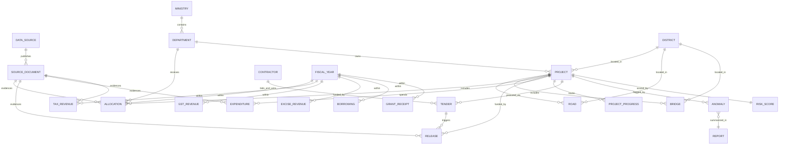
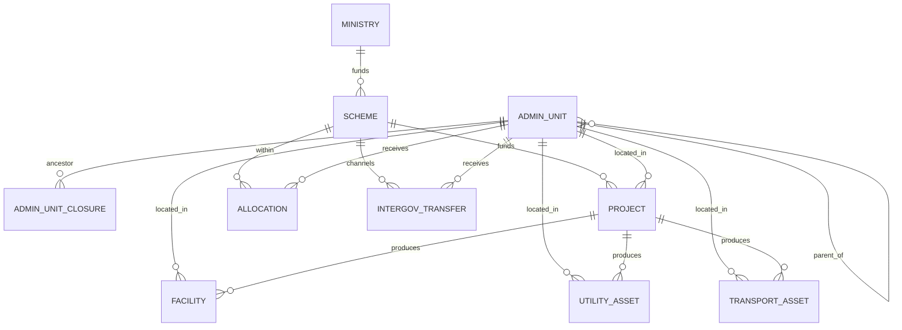

# 04 — Database Design

**Engine:** PostgreSQL 16 + PostGIS. **Conventions:** `snake_case`; surrogate `BIGINT`/`UUID` PKs; every fact table carries provenance (`source_document_id`, `confidence`, `record_version`); monetary amounts stored as `NUMERIC(20,2)` in **rupees** (paise precision), never floats; timestamps `TIMESTAMPTZ`. Amounts are stored canonically in ₹; crore/lakh formatting is a presentation concern.

## Design notes

- **Provenance is mandatory** on every fact row. This enforces the traceability rules in [15](../17-legal/legal-ethical-rules.md).
- **Versioning** is done with `record_version` + `superseded_by_id` + `valid_from/valid_to` so historical values (e.g. budget revisions) are preserved.
- **Consistency checks are recorded, not enforced destructively.** We use `CHECK` constraints only for physically impossible values (e.g. negative amounts). Business inconsistencies (utilized > released) are captured as `anomalies`, because the source data itself may be inconsistent and we must show it faithfully.
- **Money never uses `FLOAT`.** `NUMERIC(20,2)` throughout.

---

## ER diagram (Mermaid)



---

## Reference / lookup tables

```sql
-- Fiscal year canonical dimension
CREATE TABLE fiscal_year (
    id           SMALLINT PRIMARY KEY,               -- e.g. 2024 means FY2024-25
    label        TEXT NOT NULL UNIQUE,               -- 'FY2024-25'
    start_date   DATE NOT NULL,
    end_date     DATE NOT NULL,
    CHECK (end_date > start_date)
);

-- Government hierarchy
CREATE TABLE ministry (
    id           BIGSERIAL PRIMARY KEY,
    name         TEXT NOT NULL,
    tier         TEXT NOT NULL CHECK (tier IN ('central','state')),
    state_code   TEXT,                               -- 'MH' for Maharashtra; null for central
    created_at   TIMESTAMPTZ NOT NULL DEFAULT now(),
    UNIQUE (name, tier, state_code)
);

CREATE TABLE department (
    id            BIGSERIAL PRIMARY KEY,
    ministry_id   BIGINT NOT NULL REFERENCES ministry(id),
    name          TEXT NOT NULL,                     -- 'Public Works Department'
    code          TEXT,                              -- official dept/demand code
    domain        TEXT,                              -- 'roads','health',...
    created_at    TIMESTAMPTZ NOT NULL DEFAULT now(),
    UNIQUE (ministry_id, name)
);

-- Geography (PostGIS)
CREATE TABLE district (
    id           BIGSERIAL PRIMARY KEY,
    lgd_code     TEXT UNIQUE,                        -- official Local Govt Directory code
    name         TEXT NOT NULL,
    state_code   TEXT NOT NULL DEFAULT 'MH',
    geom         GEOMETRY(MultiPolygon, 4326),
    created_at   TIMESTAMPTZ NOT NULL DEFAULT now()
);
CREATE INDEX idx_district_geom ON district USING GIST (geom);
```

## Provenance tables (used everywhere)

```sql
CREATE TABLE data_source (
    id            BIGSERIAL PRIMARY KEY,
    source_key    TEXT NOT NULL UNIQUE,              -- 'mh_pwd_works'
    name          TEXT NOT NULL,
    authority     TEXT NOT NULL,                     -- issuing govt body
    tier          TEXT NOT NULL CHECK (tier IN ('central','state','local')),
    base_url      TEXT,
    license       TEXT,
    created_at    TIMESTAMPTZ NOT NULL DEFAULT now()
);

CREATE TABLE source_document (
    id                BIGSERIAL PRIMARY KEY,
    data_source_id    BIGINT NOT NULL REFERENCES data_source(id),
    url               TEXT,                          -- direct link shown to users
    title             TEXT,
    artifact_sha256   TEXT NOT NULL,                 -- immutable raw artifact hash
    retrieved_at      TIMESTAMPTZ NOT NULL,
    published_at      DATE,
    doc_type          TEXT CHECK (doc_type IN ('api','csv','xls','pdf','scan','html')),
    page_locator      TEXT,                          -- e.g. 'p.42 table 3'
    extraction_method TEXT,                          -- 'camelot','ocr:tesseract',...
    created_at        TIMESTAMPTZ NOT NULL DEFAULT now()
);
CREATE INDEX idx_source_document_source ON source_document(data_source_id);

-- Reusable provenance columns pattern (embedded in each fact table):
--   source_document_id BIGINT NOT NULL REFERENCES source_document(id)
--   confidence         NUMERIC(4,3) NOT NULL DEFAULT 1.000  -- 0..1
--   record_version     INT NOT NULL DEFAULT 1
--   superseded_by_id   BIGINT                               -- self-FK, null = current
--   valid_from         TIMESTAMPTZ NOT NULL DEFAULT now()
--   valid_to           TIMESTAMPTZ                          -- null = still valid
--   missing_reason     TEXT                                 -- when a value is null on purpose
```

## Revenue tables

```sql
CREATE TABLE tax_revenue (
    id                 BIGSERIAL PRIMARY KEY,
    fiscal_year_id     SMALLINT NOT NULL REFERENCES fiscal_year(id),
    ministry_id        BIGINT REFERENCES ministry(id),   -- govt whose revenue this is
    tax_head           TEXT NOT NULL,                    -- 'income_tax','corporation_tax','stamp_duty'...
    amount_inr         NUMERIC(20,2) NOT NULL CHECK (amount_inr >= 0),
    is_revised         BOOLEAN NOT NULL DEFAULT false,   -- RE vs BE vs actuals
    estimate_type      TEXT CHECK (estimate_type IN ('BE','RE','actual')),
    source_document_id BIGINT NOT NULL REFERENCES source_document(id),
    confidence         NUMERIC(4,3) NOT NULL DEFAULT 1.000,
    record_version     INT NOT NULL DEFAULT 1,
    superseded_by_id   BIGINT REFERENCES tax_revenue(id),
    valid_from         TIMESTAMPTZ NOT NULL DEFAULT now(),
    valid_to           TIMESTAMPTZ
);
CREATE INDEX idx_tax_revenue_fy ON tax_revenue(fiscal_year_id);
CREATE INDEX idx_tax_revenue_head ON tax_revenue(tax_head);

CREATE TABLE gst_revenue (
    id                 BIGSERIAL PRIMARY KEY,
    fiscal_year_id     SMALLINT NOT NULL REFERENCES fiscal_year(id),
    component          TEXT NOT NULL CHECK (component IN ('CGST','SGST','IGST','cess')),
    amount_inr         NUMERIC(20,2) NOT NULL CHECK (amount_inr >= 0),
    estimate_type      TEXT CHECK (estimate_type IN ('BE','RE','actual')),
    source_document_id BIGINT NOT NULL REFERENCES source_document(id),
    confidence         NUMERIC(4,3) NOT NULL DEFAULT 1.000,
    record_version     INT NOT NULL DEFAULT 1,
    superseded_by_id   BIGINT REFERENCES gst_revenue(id),
    valid_from         TIMESTAMPTZ NOT NULL DEFAULT now(),
    valid_to           TIMESTAMPTZ
);
CREATE INDEX idx_gst_fy ON gst_revenue(fiscal_year_id);

CREATE TABLE excise_revenue (
    id                 BIGSERIAL PRIMARY KEY,
    fiscal_year_id     SMALLINT NOT NULL REFERENCES fiscal_year(id),
    category           TEXT NOT NULL,                    -- 'state_excise','liquor',...
    amount_inr         NUMERIC(20,2) NOT NULL CHECK (amount_inr >= 0),
    estimate_type      TEXT CHECK (estimate_type IN ('BE','RE','actual')),
    source_document_id BIGINT NOT NULL REFERENCES source_document(id),
    confidence         NUMERIC(4,3) NOT NULL DEFAULT 1.000,
    record_version     INT NOT NULL DEFAULT 1,
    superseded_by_id   BIGINT REFERENCES excise_revenue(id),
    valid_from         TIMESTAMPTZ NOT NULL DEFAULT now(),
    valid_to           TIMESTAMPTZ
);

CREATE TABLE borrowing (
    id                 BIGSERIAL PRIMARY KEY,
    fiscal_year_id     SMALLINT NOT NULL REFERENCES fiscal_year(id),
    instrument         TEXT NOT NULL,                    -- 'market_loan','SDL','ways_and_means'...
    amount_inr         NUMERIC(20,2) NOT NULL CHECK (amount_inr >= 0),
    interest_rate_pct  NUMERIC(6,3),
    estimate_type      TEXT CHECK (estimate_type IN ('BE','RE','actual')),
    source_document_id BIGINT NOT NULL REFERENCES source_document(id),
    confidence         NUMERIC(4,3) NOT NULL DEFAULT 1.000,
    record_version     INT NOT NULL DEFAULT 1,
    superseded_by_id   BIGINT REFERENCES borrowing(id),
    valid_from         TIMESTAMPTZ NOT NULL DEFAULT now(),
    valid_to           TIMESTAMPTZ
);

CREATE TABLE grant_receipt (
    id                 BIGSERIAL PRIMARY KEY,
    fiscal_year_id     SMALLINT NOT NULL REFERENCES fiscal_year(id),
    grant_type         TEXT NOT NULL,                    -- 'finance_commission','centrally_sponsored',...
    from_authority     TEXT,                             -- e.g. 'Union Government'
    to_ministry_id     BIGINT REFERENCES ministry(id),
    amount_inr         NUMERIC(20,2) NOT NULL CHECK (amount_inr >= 0),
    estimate_type      TEXT CHECK (estimate_type IN ('BE','RE','actual')),
    source_document_id BIGINT NOT NULL REFERENCES source_document(id),
    confidence         NUMERIC(4,3) NOT NULL DEFAULT 1.000,
    record_version     INT NOT NULL DEFAULT 1,
    superseded_by_id   BIGINT REFERENCES grant_receipt(id),
    valid_from         TIMESTAMPTZ NOT NULL DEFAULT now(),
    valid_to           TIMESTAMPTZ
);
```

## Project, roads, bridges

```sql
CREATE TABLE project (
    id                 BIGSERIAL PRIMARY KEY,
    external_work_id   TEXT,                              -- official work/scheme id
    name               TEXT NOT NULL,
    department_id      BIGINT NOT NULL REFERENCES department(id),
    district_id        BIGINT REFERENCES district(id),
    category           TEXT NOT NULL CHECK (category IN
                         ('state_highway','national_highway','bridge','rural_road','urban_road','other')),
    scheme_code        TEXT,
    fiscal_year_id     SMALLINT REFERENCES fiscal_year(id),
    sanctioned_amount  NUMERIC(20,2) CHECK (sanctioned_amount >= 0),
    status             TEXT CHECK (status IN
                         ('sanctioned','tendered','in_progress','completed','stalled','unknown')),
    start_date         DATE,
    expected_end_date  DATE,
    actual_end_date    DATE,
    source_document_id BIGINT NOT NULL REFERENCES source_document(id),
    confidence         NUMERIC(4,3) NOT NULL DEFAULT 1.000,
    record_version     INT NOT NULL DEFAULT 1,
    superseded_by_id   BIGINT REFERENCES project(id),
    created_at         TIMESTAMPTZ NOT NULL DEFAULT now(),
    UNIQUE (external_work_id, fiscal_year_id)
);
CREATE INDEX idx_project_department ON project(department_id);
CREATE INDEX idx_project_district ON project(district_id);
CREATE INDEX idx_project_category ON project(category);
CREATE INDEX idx_project_status ON project(status);

CREATE TABLE road (
    id                 BIGSERIAL PRIMARY KEY,
    project_id         BIGINT NOT NULL REFERENCES project(id) ON DELETE CASCADE,
    district_id        BIGINT REFERENCES district(id),
    road_class         TEXT CHECK (road_class IN ('NH','SH','MDR','ODR','rural','urban')),
    length_km          NUMERIC(10,3) CHECK (length_km >= 0),
    width_m            NUMERIC(6,2)  CHECK (width_m >= 0),
    surface_type       TEXT,                              -- 'bituminous','concrete','WBM'...
    geom               GEOMETRY(MultiLineString, 4326),
    source_document_id BIGINT NOT NULL REFERENCES source_document(id),
    confidence         NUMERIC(4,3) NOT NULL DEFAULT 1.000
);
CREATE INDEX idx_road_project ON road(project_id);
CREATE INDEX idx_road_geom ON road USING GIST (geom);

CREATE TABLE bridge (
    id                 BIGSERIAL PRIMARY KEY,
    project_id         BIGINT NOT NULL REFERENCES project(id) ON DELETE CASCADE,
    district_id        BIGINT REFERENCES district(id),
    span_m             NUMERIC(10,2) CHECK (span_m >= 0),
    bridge_type        TEXT,                              -- 'RCC','steel','culvert'...
    over_feature       TEXT,                              -- river/rail crossed
    geom               GEOMETRY(Point, 4326),
    source_document_id BIGINT NOT NULL REFERENCES source_document(id),
    confidence         NUMERIC(4,3) NOT NULL DEFAULT 1.000
);
CREATE INDEX idx_bridge_project ON bridge(project_id);
CREATE INDEX idx_bridge_geom ON bridge USING GIST (geom);

CREATE TABLE project_progress (
    id                 BIGSERIAL PRIMARY KEY,
    project_id         BIGINT NOT NULL REFERENCES project(id) ON DELETE CASCADE,
    as_of_date         DATE NOT NULL,
    physical_pct       NUMERIC(5,2) CHECK (physical_pct BETWEEN 0 AND 100),
    financial_pct      NUMERIC(5,2) CHECK (financial_pct BETWEEN 0 AND 100),
    status_note        TEXT,
    source_document_id BIGINT NOT NULL REFERENCES source_document(id),
    confidence         NUMERIC(4,3) NOT NULL DEFAULT 1.000,
    UNIQUE (project_id, as_of_date)
);
CREATE INDEX idx_progress_project ON project_progress(project_id);
```

## Contractors & tenders

```sql
CREATE TABLE contractor (
    id                 BIGSERIAL PRIMARY KEY,
    canonical_name     TEXT NOT NULL,                     -- normalized
    registration_no    TEXT,                              -- official reg id if published
    class_grade        TEXT,                              -- PWD contractor class
    created_at         TIMESTAMPTZ NOT NULL DEFAULT now(),
    UNIQUE (canonical_name, registration_no)
);
-- raw name variants preserved for traceability of canonicalization
CREATE TABLE contractor_alias (
    id             BIGSERIAL PRIMARY KEY,
    contractor_id  BIGINT NOT NULL REFERENCES contractor(id) ON DELETE CASCADE,
    raw_name       TEXT NOT NULL,
    match_score    NUMERIC(4,3),
    source_document_id BIGINT REFERENCES source_document(id)
);
CREATE INDEX idx_contractor_alias_cid ON contractor_alias(contractor_id);

CREATE TABLE tender (
    id                 BIGSERIAL PRIMARY KEY,
    external_tender_id TEXT UNIQUE,                       -- e-tender id
    project_id         BIGINT REFERENCES project(id),
    department_id      BIGINT REFERENCES department(id),
    contractor_id      BIGINT REFERENCES contractor(id),  -- awarded to (null if open/unknown)
    title              TEXT,
    estimated_cost     NUMERIC(20,2) CHECK (estimated_cost >= 0),
    awarded_amount     NUMERIC(20,2) CHECK (awarded_amount >= 0),
    num_bidders        INT CHECK (num_bidders >= 0),
    published_date     DATE,
    awarded_date       DATE,
    status             TEXT CHECK (status IN
                         ('published','bidding','awarded','cancelled','unknown')),
    source_document_id BIGINT NOT NULL REFERENCES source_document(id),
    confidence         NUMERIC(4,3) NOT NULL DEFAULT 1.000,
    record_version     INT NOT NULL DEFAULT 1,
    superseded_by_id   BIGINT REFERENCES tender(id)
);
CREATE INDEX idx_tender_project ON tender(project_id);
CREATE INDEX idx_tender_contractor ON tender(contractor_id);
CREATE INDEX idx_tender_dept ON tender(department_id);
```

## Finance flow: allocations, releases, expenditures

```sql
CREATE TABLE allocation (
    id                 BIGSERIAL PRIMARY KEY,
    fiscal_year_id     SMALLINT NOT NULL REFERENCES fiscal_year(id),
    department_id      BIGINT REFERENCES department(id),
    project_id         BIGINT REFERENCES project(id),      -- null = dept-level allocation
    scheme_code        TEXT,
    amount_inr         NUMERIC(20,2) NOT NULL CHECK (amount_inr >= 0),
    estimate_type      TEXT CHECK (estimate_type IN ('BE','RE','actual')),
    is_revision        BOOLEAN NOT NULL DEFAULT false,
    source_document_id BIGINT NOT NULL REFERENCES source_document(id),
    confidence         NUMERIC(4,3) NOT NULL DEFAULT 1.000,
    record_version     INT NOT NULL DEFAULT 1,
    superseded_by_id   BIGINT REFERENCES allocation(id),
    valid_from         TIMESTAMPTZ NOT NULL DEFAULT now(),
    valid_to           TIMESTAMPTZ
);
CREATE INDEX idx_alloc_project ON allocation(project_id);
CREATE INDEX idx_alloc_dept_fy ON allocation(department_id, fiscal_year_id);

CREATE TABLE release (
    id                 BIGSERIAL PRIMARY KEY,
    fiscal_year_id     SMALLINT NOT NULL REFERENCES fiscal_year(id),
    project_id         BIGINT REFERENCES project(id),
    tender_id          BIGINT REFERENCES tender(id),
    amount_inr         NUMERIC(20,2) NOT NULL CHECK (amount_inr >= 0),
    release_date       DATE,
    installment_no     INT,
    source_document_id BIGINT NOT NULL REFERENCES source_document(id),
    confidence         NUMERIC(4,3) NOT NULL DEFAULT 1.000,
    record_version     INT NOT NULL DEFAULT 1,
    superseded_by_id   BIGINT REFERENCES release(id)
);
CREATE INDEX idx_release_project ON release(project_id);

CREATE TABLE expenditure (
    id                 BIGSERIAL PRIMARY KEY,
    fiscal_year_id     SMALLINT NOT NULL REFERENCES fiscal_year(id),
    project_id         BIGINT REFERENCES project(id),
    amount_inr         NUMERIC(20,2) NOT NULL CHECK (amount_inr >= 0),
    expense_date       DATE,
    head_of_account    TEXT,
    source_document_id BIGINT NOT NULL REFERENCES source_document(id),
    confidence         NUMERIC(4,3) NOT NULL DEFAULT 1.000,
    record_version     INT NOT NULL DEFAULT 1,
    superseded_by_id   BIGINT REFERENCES expenditure(id)
);
CREATE INDEX idx_expenditure_project ON expenditure(project_id);
```

> **Why no `CHECK (utilized <= released)`?** Because the _source data itself_ may violate it, and our job is to display the real figures and **flag** the inconsistency — not to reject official data. That flag lives in `anomaly`.

## Audit: anomalies & reports

```sql
CREATE TABLE anomaly (
    id                 BIGSERIAL PRIMARY KEY,
    project_id         BIGINT REFERENCES project(id),
    department_id      BIGINT REFERENCES department(id),
    district_id        BIGINT REFERENCES district(id),
    anomaly_type       TEXT NOT NULL CHECK (anomaly_type IN (
                         'variance_gap','utilization_exceeds_release',
                         'release_exceeds_allocation','cost_per_km_outlier',
                         'missing_records','budget_revision_spike',
                         'contractor_concentration','delay')),
    severity           TEXT NOT NULL CHECK (severity IN ('info','low','medium','high')),
    -- Neutral, factual description ONLY. Enforced in application + reviewed. See doc 15.
    observation        TEXT NOT NULL,           -- e.g. "Utilized amount is 12% above released amount."
    metric_value       NUMERIC(20,4),           -- the number behind the flag
    threshold_value    NUMERIC(20,4),
    confidence         NUMERIC(4,3) NOT NULL DEFAULT 1.000,
    detected_at        TIMESTAMPTZ NOT NULL DEFAULT now(),
    dataset_version    BIGINT NOT NULL,
    -- provenance: which figures produced this flag
    evidence           JSONB NOT NULL           -- [{table, row_id, source_document_id}, ...]
);
CREATE INDEX idx_anomaly_project ON anomaly(project_id);
CREATE INDEX idx_anomaly_type ON anomaly(anomaly_type);
CREATE INDEX idx_anomaly_severity ON anomaly(severity);

CREATE TABLE risk_score (
    project_id         BIGINT PRIMARY KEY REFERENCES project(id) ON DELETE CASCADE,
    score              SMALLINT NOT NULL CHECK (score BETWEEN 0 AND 100),
    factors            JSONB NOT NULL,          -- per-factor contributions (see doc 07)
    computed_at        TIMESTAMPTZ NOT NULL DEFAULT now(),
    dataset_version    BIGINT NOT NULL
);

CREATE TABLE report (
    id                 BIGSERIAL PRIMARY KEY,
    scope_type         TEXT NOT NULL CHECK (scope_type IN ('project','district','department','state')),
    scope_id           BIGINT,
    title              TEXT NOT NULL,
    summary            TEXT NOT NULL,           -- neutral, source-linked
    generated_by       TEXT CHECK (generated_by IN ('system','ai','analyst')),
    dataset_version    BIGINT NOT NULL,
    created_at         TIMESTAMPTZ NOT NULL DEFAULT now()
);
CREATE TABLE report_anomaly (
    report_id  BIGINT NOT NULL REFERENCES report(id) ON DELETE CASCADE,
    anomaly_id BIGINT NOT NULL REFERENCES anomaly(id) ON DELETE CASCADE,
    PRIMARY KEY (report_id, anomaly_id)
);
```

## Security / operational tables

```sql
CREATE TABLE app_user (
    id            BIGSERIAL PRIMARY KEY,
    email         CITEXT UNIQUE NOT NULL,
    role          TEXT NOT NULL CHECK (role IN ('public','journalist','researcher','analyst','admin')),
    api_key_hash  TEXT,
    created_at    TIMESTAMPTZ NOT NULL DEFAULT now()
);

CREATE TABLE audit_log (
    id           BIGSERIAL PRIMARY KEY,
    actor        TEXT NOT NULL,                  -- user id or 'system:<worker>'
    action       TEXT NOT NULL,                  -- 'ingest','load','recompute','export','login'
    entity       TEXT,
    entity_id    BIGINT,
    detail       JSONB,
    at           TIMESTAMPTZ NOT NULL DEFAULT now()
);
CREATE INDEX idx_audit_at ON audit_log(at);

CREATE TABLE dataset_version (
    version      BIGSERIAL PRIMARY KEY,
    note         TEXT,
    published_at TIMESTAMPTZ NOT NULL DEFAULT now()
);
```

## Materialized views (read surface for API)

```sql
-- Per-project financial rollup used by the dashboard & API
CREATE MATERIALIZED VIEW mv_project_finance AS
SELECT
    p.id AS project_id,
    p.name,
    p.category,
    p.district_id,
    p.department_id,
    COALESCE(SUM(a.amount_inr) FILTER (WHERE a.superseded_by_id IS NULL), 0) AS allocated_inr,
    COALESCE(SUM(r.amount_inr) FILTER (WHERE r.superseded_by_id IS NULL), 0) AS released_inr,
    COALESCE(SUM(e.amount_inr) FILTER (WHERE e.superseded_by_id IS NULL), 0) AS utilized_inr
FROM project p
LEFT JOIN allocation  a ON a.project_id = p.id
LEFT JOIN release     r ON r.project_id = p.id
LEFT JOIN expenditure e ON e.project_id = p.id
GROUP BY p.id;

CREATE UNIQUE INDEX idx_mv_project_finance ON mv_project_finance(project_id);
-- Refreshed CONCURRENTLY by the analytics cron after each ETL publish.
```

Derived quantities (variance, deviation %, cost/km) are computed by the analytics service and stored/served alongside these rollups — formulas in [06](../07-analytics/analytics-engine.md) and [08](../03-domain/road-infrastructure-intelligence.md).

---

# National-scale extensions (village → nation)

These tables generalize the Phase-1 schema to the full administrative hierarchy, urban/rural local bodies, schemes, and social/utility infrastructure ([19](../03-domain/administrative-hierarchy.md), [20](../03-domain/gis-intelligence.md)). The existing revenue/allocation/release/expenditure/anomaly tables carry over unchanged; they simply reference `admin_unit` and `scheme` in addition to `department`/`project`.

## Administrative hierarchy (generic + closure)

A generic unit tree handles urban, rural, and hybrid paths uniformly; a closure table answers "everything under unit X" without recursion at query time.

```sql
CREATE TABLE admin_unit (
    id           BIGSERIAL PRIMARY KEY,
    parent_id    BIGINT REFERENCES admin_unit(id),
    level        TEXT NOT NULL CHECK (level IN (
                   'nation','state','division','district','taluka','block',
                   'municipal_corporation','municipality','nagar_panchayat','cantonment',
                   'zilla_parishad','panchayat_samiti','gram_panchayat','village','ward')),
    name         TEXT NOT NULL,
    lgd_code     TEXT,                 -- Local Government Directory code (primary cross-source key)
    census_code  TEXT,
    ulb_code     TEXT,                 -- for urban bodies
    pri_code     TEXT,                 -- for panchayati raj units
    state_code   TEXT,                 -- 'MH', ...
    geom         GEOMETRY(MultiPolygon, 4326),
    population   BIGINT,               -- for per-capita metrics (census)
    valid_from   DATE,                 -- boundary/existence versioning
    valid_to     DATE,
    created_at   TIMESTAMPTZ NOT NULL DEFAULT now(),
    UNIQUE (level, lgd_code)
);
CREATE INDEX idx_admin_unit_parent ON admin_unit(parent_id);
CREATE INDEX idx_admin_unit_level  ON admin_unit(level);
CREATE INDEX idx_admin_unit_lgd    ON admin_unit(lgd_code);
CREATE INDEX idx_admin_unit_geom   ON admin_unit USING GIST (geom);

-- closure table: one row per ancestor→descendant pair (incl. self, depth 0)
CREATE TABLE admin_unit_closure (
    ancestor_id   BIGINT NOT NULL REFERENCES admin_unit(id) ON DELETE CASCADE,
    descendant_id BIGINT NOT NULL REFERENCES admin_unit(id) ON DELETE CASCADE,
    depth         INT NOT NULL,
    PRIMARY KEY (ancestor_id, descendant_id)
);
CREATE INDEX idx_closure_desc ON admin_unit_closure(descendant_id);
```

> `district`, `road.district_id`, etc. from Phase 1 remain valid; at national scale they are convenience views/foreign keys onto `admin_unit` rows of the relevant `level`. New code references `admin_unit`.

## Local-body finance link

Local bodies receive money both via budget allocation and via inter-governmental transfers/grants; both are captured by pointing existing finance tables at `admin_unit` and by a transfers table.

```sql
CREATE TABLE intergov_transfer (
    id                 BIGSERIAL PRIMARY KEY,
    fiscal_year_id     SMALLINT NOT NULL REFERENCES fiscal_year(id),
    from_level         TEXT NOT NULL,          -- 'nation','state'
    from_unit_id       BIGINT REFERENCES admin_unit(id),
    to_unit_id         BIGINT NOT NULL REFERENCES admin_unit(id),
    scheme_id          BIGINT REFERENCES scheme(id),
    transfer_type      TEXT,                   -- 'finance_commission','cSS','state_scheme','grant'
    amount_inr         NUMERIC(20,2) NOT NULL CHECK (amount_inr >= 0),
    source_document_id BIGINT NOT NULL REFERENCES source_document(id),
    confidence         NUMERIC(4,3) NOT NULL DEFAULT 1.000,
    record_version     INT NOT NULL DEFAULT 1,
    superseded_by_id   BIGINT REFERENCES intergov_transfer(id)
);
CREATE INDEX idx_transfer_to ON intergov_transfer(to_unit_id);
```

`allocation`, `release`, `expenditure` gain an optional `admin_unit_id BIGINT REFERENCES admin_unit(id)` so finance can attach at any level (district, ULB, GP), not only to a `project`/`department`.

## Schemes

```sql
CREATE TABLE scheme (
    id           BIGSERIAL PRIMARY KEY,
    scheme_code  TEXT UNIQUE,             -- official code
    name         TEXT NOT NULL,           -- 'PMGSY', 'AMRUT', 'MGNREGA', ...
    ministry_id  BIGINT REFERENCES ministry(id),
    scheme_type  TEXT CHECK (scheme_type IN ('central_sector','centrally_sponsored','state','local')),
    domain       TEXT,                    -- 'roads','health','education','water',...
    created_at   TIMESTAMPTZ NOT NULL DEFAULT now()
);
-- project gains: scheme_id BIGINT REFERENCES scheme(id)
-- allocation/release/expenditure gain: scheme_id BIGINT REFERENCES scheme(id)
```

## Social & utility infrastructure (asset tables)

Same pattern as `road`/`bridge` ([Phase-1 tables above]) — each links to a `project`, an `admin_unit`, carries geometry + provenance, and adds capacity attributes that power cost-per-unit metrics ([06](../07-analytics/analytics-engine.md)).

```sql
CREATE TABLE facility (                    -- generic social-infra asset
    id                 BIGSERIAL PRIMARY KEY,
    project_id         BIGINT REFERENCES project(id) ON DELETE SET NULL,
    admin_unit_id      BIGINT REFERENCES admin_unit(id),
    facility_type      TEXT NOT NULL CHECK (facility_type IN
                         ('school','college','hospital','phc','chc','anganwadi',
                          'park','sports_complex','office','other')),
    name               TEXT,
    -- capacity attributes (nullable; only the relevant ones populated per type)
    beds               INT CHECK (beds >= 0),          -- hospitals/PHC/CHC
    classrooms         INT CHECK (classrooms >= 0),    -- schools/colleges
    seats              INT CHECK (seats >= 0),         -- colleges
    area_sqm           NUMERIC(12,2),
    geom               GEOMETRY(Point, 4326),
    source_document_id BIGINT NOT NULL REFERENCES source_document(id),
    confidence         NUMERIC(4,3) NOT NULL DEFAULT 1.000
);
CREATE INDEX idx_facility_project ON facility(project_id);
CREATE INDEX idx_facility_unit    ON facility(admin_unit_id);
CREATE INDEX idx_facility_type    ON facility(facility_type);
CREATE INDEX idx_facility_geom    ON facility USING GIST (geom);

CREATE TABLE utility_asset (               -- electricity/water/sewage/gas/internet
    id                 BIGSERIAL PRIMARY KEY,
    project_id         BIGINT REFERENCES project(id) ON DELETE SET NULL,
    admin_unit_id      BIGINT REFERENCES admin_unit(id),
    utility_type       TEXT NOT NULL CHECK (utility_type IN
                         ('electricity','water','sewage','gas','internet')),
    asset_kind         TEXT,               -- 'line','pipeline','substation','plant','node'
    length_km          NUMERIC(10,3) CHECK (length_km >= 0),
    capacity           NUMERIC(14,2),      -- MW / MLD / etc. (unit in capacity_unit)
    capacity_unit      TEXT,
    geom               GEOMETRY(Geometry, 4326),   -- line or point
    source_document_id BIGINT NOT NULL REFERENCES source_document(id),
    confidence         NUMERIC(4,3) NOT NULL DEFAULT 1.000
);
CREATE INDEX idx_utility_unit ON utility_asset(admin_unit_id);
CREATE INDEX idx_utility_geom ON utility_asset USING GIST (geom);

CREATE TABLE transport_asset (             -- metro/railway/airport/port/tunnel/flyover
    id                 BIGSERIAL PRIMARY KEY,
    project_id         BIGINT REFERENCES project(id) ON DELETE SET NULL,
    admin_unit_id      BIGINT REFERENCES admin_unit(id),
    transport_type     TEXT NOT NULL CHECK (transport_type IN
                         ('metro','railway','airport','port','tunnel','flyover')),
    length_km          NUMERIC(10,3),
    geom               GEOMETRY(Geometry, 4326),
    source_document_id BIGINT NOT NULL REFERENCES source_document(id),
    confidence         NUMERIC(4,3) NOT NULL DEFAULT 1.000
);
CREATE INDEX idx_transport_unit ON transport_asset(admin_unit_id);
CREATE INDEX idx_transport_geom ON transport_asset USING GIST (geom);
```

## National ER diagram (hierarchy + finance)



## Partitioning at national scale

Large fact tables (`allocation`, `release`, `expenditure`, `intergov_transfer`, `anomaly`) are **range-partitioned by `fiscal_year_id`** and, when India-wide, **list-sub-partitioned by `state_code`**, keeping per-state working sets small ([14](../15-scalability/scalability-plan.md)). Asset tables partition by `state_code`. Closure and `admin_unit` stay global but indexed.
