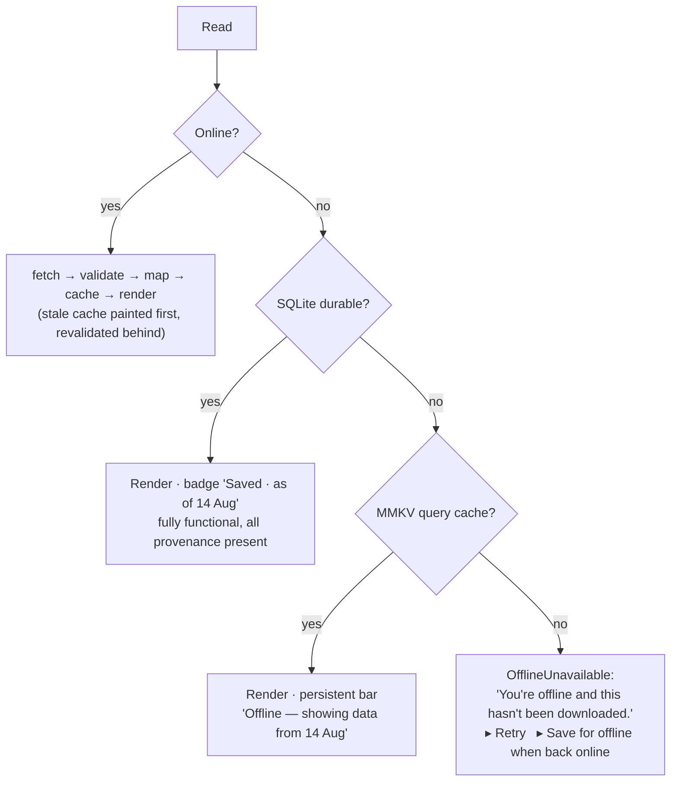

# 11 — Offline & Low-Network Strategy

## The operating environment

This app will be used on a ₹8,000 Android phone, on a prepaid data pack, in a taluka office with one bar of 3G, by someone who may be standing outside the building whose accounts they are checking. Network is intermittent, metered, and often absent. An architecture that treats offline as an error state fails the product's primary audience.

**Three commitments:**

1. **The app always opens.** No network call blocks first paint (`.docs/02-architecture/data-flow.md` §11).
2. **Anything the user saved is guaranteed complete offline** — including its provenance.
3. **Stale is never silent.** Every cached figure carries and displays its `asOf` and `datasetVersion`.

And one rule that outranks the others:

> **"We don't have this because you're offline" and "the government hasn't published this" are different statements, and the app must never confuse them.**

Conflating them turns a dropped connection into an implied accusation of non-publication against a government body. That is a `.docs/17-legal/legal-ethical-rules.md` violation dressed as a UI shortcut.

---

## Three storage tiers

| Tier | Store | Contents | Lifetime | Guarantee |
|---|---|---|---|---|
| **1 · Ephemeral** | TanStack Query → MMKV | Everything recently viewed | LRU, 24 MB, 14-day max age | "What you looked at recently still opens" |
| **2 · Durable** | SQLite (Drizzle) | Saved items + full offline bundles; queued reports | Until the user deletes | "Saved means saved" |
| **3 · Binary** | Filesystem + map tile store | Downloaded documents; offline map packs | Until the user deletes | "You chose this; it stays" |

Rationale for two stores rather than one: an LRU cache and a user's saved evidence file have opposite requirements. The cache must be free to evict; the saved file must never be. Merging them means either an unbounded cache or silently losing a journalist's saved project. See `adr/005-local-storage.md`.

---

## What a "saved" item actually contains

Saving is not bookmarking an ID. It downloads a self-contained bundle:

```text
Saved project 501  (~40–90 KB, stated before download)
├── project record (all fields)
├── finance chain: allocated/released/utilized totals + BOTH variances + status
├── ledger lines (all allocations, releases, expenditures)
├── observations + their evidence references
├── verification priority + all six factors + confidence
├── tender + contractor summary
├── road/asset intelligence + model coefficients + caveats
├── progress snapshots
├── PROVENANCE for every figure above          ← the point
├── coverage record (what is missing and why)
└── asOf + datasetVersion
```

Provenance is in the bundle, so **traceability survives offline**: the source sheet opens, names the authority, the page locator, the extraction method and the confidence, with no network. Only the document *body* requires a connection, and that gap is stated plainly.

Documents are **not** auto-downloaded — a scanned budget PDF can be 80 MB. The bundle stores the document metadata; downloading the artifact is a separate, size-labelled action (S-54).

---

## Offline packs (S-64)

Opt-in, Wi-Fi-preferred, explicitly sized:

| Pack | Contents | Typical size |
|---|---|---|
| District | unit tree (talukas → GPs), project index, per-unit finance summaries, map tiles z6–13 for the bbox | 8–40 MB |
| Taluka | as above, one level down, tiles z9–14 | 2–8 MB |
| Item bundle | one project/unit as above | 40–200 KB |

Rules: size shown **before** download · resumable, and a partial pack is usable (with a statement of what is missing) · pinned to a `datasetVersion` · refreshed by delta (`?since=` — `00-document-audit` M4), never re-downloaded · Wi-Fi-only toggle, default on · storage usage and per-pack delete in S-70.

---

## Read decision tree



---

## Degradation by feature

| Feature | Offline behaviour |
|---|---|
| Home | Cached scope summary + offline bar; "Near you" falls back to the last known scope unit |
| Search | Local FTS5 over saved + recently-viewed, labelled *"searching your saved items only (24 items)"* |
| Map | Cached tiles + downloaded packs; un-cached area is a **labelled hatch**, never a blank |
| Unit / Project | Cached or saved; per-section `OfflineUnavailable` for sections not in cache |
| Money Trail | Full, from the bundle |
| Source sheet | **Full** — metadata, confidence, page locator, authority |
| Document viewer | Only if downloaded; otherwise the size and a queued-download option |
| Observations | Cached list; filters that need a server round trip are disabled with a reason |
| Ask | **Disabled**, stated plainly; history readable (`.docs/09-ai/ai-client-experience.md`) |
| Save / unsave | Works. Local-first by design |
| Report a data issue | Queued in SQLite with an idempotency key; the user is told it is queued and will send |
| Settings | Fully functional |

---

## Communicating staleness

Three levels, escalating:

```text
1 · Fresh (< staleTime)          nothing shown
2 · Stale but online             per-figure "as of 4 Aug" caption; a subtle
                                 "Updated data available — refresh" chip if the
                                 dataset version has moved
3 · Offline                      persistent, non-blocking bar at the top:
                                 ┌───────────────────────────────────────┐
                                 │ ⚡ Offline — showing data from 14 Aug │
                                 └───────────────────────────────────────┘
                                 + every figure keeps its own asOf
```

The bar is dismissible per session but reappears on navigation. It is never a full-screen takeover — a user who is offline still needs the data.

**A figure is never rendered without its `asOf`.** Not a design preference: a ₹8 crore figure with no date is not a traceable fact.

---

## Low-network (present but bad)

Slow is often worse than absent, because the app looks broken rather than honest.

- **Effective connection type** is observed (`@react-native-community/netinfo`). On `2g`/`slow-2g`: image and map-tile prefetch disabled, page size dropped 25 → 10, timeouts raised to 20 s, and the document viewer defaults to Wi-Fi-only download.
- **Timeout → cached, not error.** An 8 s timeout with cached data present renders the cache with the offline bar. The user gets content, not a spinner that gave up.
- **Aggressive cancellation.** Navigating away aborts in-flight requests — on a metered connection, a request nobody is waiting for is stolen data.
- **No background prefetching on cellular.** Speculative fetching of adjacent screens happens on Wi-Fi only. Spending a user's data pack on content they did not ask for is not acceptable in this market.
- **Retry is bounded and visible**: 3 attempts, exponential backoff with jitter, and the UI says "Retrying (2 of 3)…" rather than spinning silently.

---

## Background refresh

Conservative by design:

| Task | When | Constraint |
|---|---|---|
| Dataset-version check | App foreground, ≤ every 5 min | One tiny request |
| Watchlist diff | Background fetch, ≥ 6 h apart | Wi-Fi preferred; a single `?since=` call (`.docs/10-mobile/notifications.md`) |
| Offline pack delta | User-initiated, or on Wi-Fi if auto-update is enabled (default **off**) | Delta only |
| Queued report flush | On reconnect | Idempotency key prevents duplicates |

No periodic content prefetch, no silent push-triggered downloads, no "warming" the cache. Every byte the app spends is either user-requested or a few hundred bytes of version check.

---

## Conflict and correctness

There is no write conflict to resolve — the ledger is read-only (`.docs/11-api/api-documentation.md`) and the only local writes are saves, settings, and queued reports. What must be handled instead is **version skew**:

- A screen must never mix figures from two `datasetVersion`s. Composite endpoints guarantee one version per payload (`.docs/02-architecture/data-flow.md` §6); when two independently-fetched sections disagree, the older section is re-fetched rather than displayed alongside the newer.
- A saved bundle keeps its version. When a refresh finds a newer one, the app shows what changed (`.docs/10-mobile/notifications.md`) rather than silently replacing the numbers a journalist may have already cited.
- A superseded record retains its predecessor (`.docs/17-legal/legal-ethical-rules.md` rule 9) — offline included.

---

## Storage budget

| Item | Default cap | User-visible |
|---|---|---|
| Query cache (MMKV) | 24 MB | Yes, clearable |
| Saved bundles (SQLite) | unbounded (small) | Yes, per item |
| Map tile cache | 60 MB LRU | Yes, clearable |
| Offline packs | unbounded | Yes, per pack with size |
| Documents | unbounded | Yes, per document with size |
| **Total default footprint** | **< 120 MB** without explicit downloads | Shown in S-70 |

On low-storage warnings from the OS, the app evicts tier 1 and the tile cache **only** — never a saved bundle or a downloaded pack, and it tells the user what it did.

---

## Testing

Offline is a first-class test surface (`.docs/14-testing/testing-strategy.md`): airplane-mode E2E flows for launch/browse/save/source-sheet, a throttled-network suite (3G profile), a "cache present, server 500" suite, a "cache present, dataset version bumped" suite, and a storage-eviction suite. A release that has not passed the offline suite does not ship.
